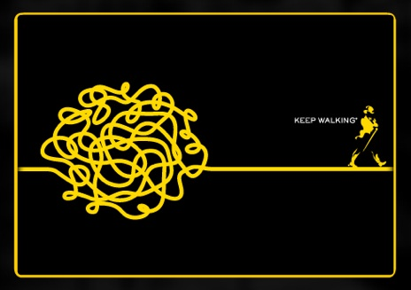

## Objetivos

- Apresentar o desenvolvimento teórico e aplicações da __teoria de Processos Estocásticos__. 
- Capacitar o aluno para a __modelagem de problemas__, __utilização de ferramentas__ abordadas no curso e __interpretação dos resultados__.

## Organização

- __Disciplina:__ Processos Estocásticos
- __Turma:__ U
- __Modalidade:__ Presencial com apoio online (Moodle)
- __Professor:__ Rodrigo Citton Padilha dos Reis
    + e-mail: rodrigocpdosreis@gmail.com ou citton.padilha@ufrgs.br
    + Sala: B215 do Instituto de Matemática e Estatística
- __Monitoria:__ _em breve teremos os horários da monitoria_

- Sala 109 do Prédio Salas de Aula Campus do Vale - 43324
- Horário: Segundas e quartas, das 10hs 30min às 12hs 10min

## Aulas e material didático

- __Aulas__
    + Exposição dos conteúdos
    + Exemplos
    + Resolução de exercícios
- __Notas de aula__
- __Listas de exercícios__
    + Soluções comentadas e respostas __(para alguns exercícios)__
- __Canais de comunicação:__
    + Durante as aulas
    + Moodle: aulas, materiais, listas de exercícios
    + Sala de aula virtual: notas das avaliações
    + e-mail do professor

## Aulas e material didático

- __Exemplos e exercícios com o apoio do computador__
    + `R` e `RStudio`

```{r echo=FALSE, fig.align='center', message=FALSE, warning=FALSE, out.width='50%', paged.print=FALSE}
knitr::include_graphics('images/Rlogo.png')
```

## Conteúdo programático

__Semanas de 1 a 9__

1. Processos Estocásticos
    + Notação e terminologia
    + Conceitos básicos
2. Cadeias de Markov a Parâmetro Discreto
    + Probabilidades de transição
    + Classificação dos estados
    + Distribuições estacionárias
    + Distribuições limites
3. Cadeias de Markov com Espaço de Estado Finito
    + Passeio Aleatório
    + Cadeias de Eherenfest
    + Cadeias de Nascimentos e Mortes
    + Cadeias de Filas
    + Cadeias de Ramificação
    
## Conteúdo programático

__Semanas de 10 a 18__

4. Cadeias de Markov a Parâmetro Contínuo
    + Distribuições finito-dimensionais
    + Propriedade fraca de Markov
    + Probabilidade de transição 
5. Processos Estocásticos a Parâmetro Contínuo
    + Processo de Poisson
    + Processo de Filas
    + Processo de Nascimentos e Mortes

## Avaliação

- Serão realizadas duas provas ($P$) e quatro listas ($ML$ é a média das listas) como atividades de avaliação
    + __As datas das provas serão definidas em breve__
- __As provas são presenciais, individuais e sem consulta__
- As listas conterão exercícios teóricos e aplicados; alguns exercícios podem necessitar do uso do computador
- Cada atividade de avaliação vale 10 pontos
- Será realizada uma prova como atividade de recuperação ($PR$)
    + Para os alunos que não atingirem o conceito mínimo __e__ com frequência mínimia de 75% 
    + __Esta prova abrange todo o conteúdo da disciplina__
    
## Avaliação

$$
NF = 0,4 \times P1 + 0,4 \times P2 + 0,2 \times ML
$$

+ __A:__ $9 \leq NF \leq 10$
+ __B:__ $7,5 \leq NF < 9$
+ __C:__ $6 \leq NF < 7,5$

+ Se $NF < 6$ e frequência $\geq$ 75%, o aluno poderá realizar a prova de recuperação e neste caso

$$
NF' = NF \times 0, 4 + PR \times 0, 6
$$    

- __C:__ $NF' \geq 6$
- __D:__ $NF' < 6$

## Referências bibliográficas

\begin{columns}[c]
\column{1.3in}
\begin{figure}[!h]
\begin{center}
\includegraphics[width=0.9\columnwidth]{images/ctanlion}
\end{center}
\end{figure}
\column{3.3in}
{\footnotesize
\begin{itemize}\setlength{\itemsep}{+2mm}
\item \structure{Durrett, R.} \emph{Essentials of Stochastic Processes}, Springer, 2012.
\item \structure{Resnick, S.} \emph{Adventures in Stochastic Processes}, Birkhauser, 1992.
\item \structure{Atuncar, G. S.} \emph{Conceitos Básicos de Processos Estocásticos}, UFMG - DEst, 2011.
\item \structure{Hinojosa, A. e Milanés, A} \emph{Uma introduação aos processos estocásticos com aplicações}, UFMG - DEst.
\end{itemize}
}
\end{columns}

## Introdução

- Uma __cadeia de Markov__ é um modelo matemático de um fenômeno aleatório que evolui com o tempo de modo que __o passado afeta o futuro apenas através do presente__.
    + O __"tempo"__ pode ser __discreto__ (isto é, os inteiros), __contínuo__ (isto é, os números reais) ou, de maneira mais geral, um conjunto totalmente ordenado.
    + Na área 1, discutiremos apenas cadeias de Markov em tempo discreto.
    + Na área 2, estudaremos cadeias de tempo contínuo.
- Na __Matemática__, um fenômeno que evolui com o tempo de maneira que somente o presente afeta o futuro é chamado de __SISTEMA DINÂMICO__.

## Introdução

- Vamos desenvolver uma teoria que nos diz como descrever, analisar e usar esses modelos matemáticos que são chamados de cadeias de Markov. 
- Também veremos porque eles são úteis e discutimos como eles são aplicados.
- Além disso, veremos que tipo de perguntas podemos fazer e que tipo de respostas podemos esperar.

## Exemplos

### O rato na gaiola

Um rato está em uma gaiola com duas células, 1 e 2, contendo queijo fresco e fedido, respectivamente. Um rato vive na gaiola. O trabalho de um cientista é registrar a posição do rato a cada minuto. Quando o rato está na célula 1 no tempo $n$ (minutos), então, no tempo $n + 1$, ele ainda está em 1 ou moveu-se para 2.

```{r echo=FALSE, fig.align='center', message=FALSE, warning=FALSE, out.width='50%', paged.print=FALSE}

```

## Exemplos

### O rato na gaiola

Observações estatísticas levam o cientista a acreditar que o rato se move da célula 1 para a célula 2 com probabilidade $\alpha = 0.05$; ele faz isso, independentemente de onde esteve em tempos anteriores. Similarmente, ele se move de 2 para 1 com probabilidade $\beta = 0.99$.

Podemos resumir essa informação pelo __DIAGRAMA DE TRANSIÇÃO__:

```{r echo=FALSE, fig.align='center', message=FALSE, warning=FALSE, out.width='50%', paged.print=FALSE}
knitr::include_graphics('images/rato_gaiola2.png')
```

## Exemplos

### O rato na gaiola

Outra maneira de resumir as informações é pela MATRIZ DE PROBABILIDADES DE TRANSIÇÃO $2 \times 2$:


$$
P = \left(\begin{array}{cc}
1 - \alpha & \alpha\\
\beta & 1 - \beta
\end{array}\right) = \left(\begin{array}{cc}
0.95 & 0.05\\
0.99 & 0.01
\end{array}\right)
$$

## Exemplos

### O rato na gaiola

__Questões de interesse:__

1. Quanto tempo leva para o rato, em média, se deslocar da célula 1 para a célula 2?
2. Com que frequência o rato está na célula 1?

## Exemplos

### Passeio aleatório simples (o andar do bêbado)

Considere uma pessoa completamente bêbada que anda por uma rua. Estando bêbado, ele não tem senso de direção. Então ele pode avançar com a mesma probabilidade de que ele se move para trás.

```{r echo=FALSE, fig.align='center', message=FALSE, warning=FALSE, out.width='70%', paged.print=FALSE}

```

## Exemplos

### Passeio aleatório simples (o andar do bêbado)

__Questões de interesse:__

1. Se ele começar da posição 0, com que frequência ele estará visitando 0?
2. Existem lugares que ele nunca visitará?
3. Há algum lugar que ele visitará infinitas vezes?
4. Se o _pub_ estiver na posição 0 e sua casa na posição 100, quanto tempo ele levará, em média, para ir do _pub_ para casa?

## Exemplos

### Passeio aleatório (generalizando)

- Podemos considerar que o sujeito não está completamente bêbado, e que a probabilidade de ir para direita é diferente de ir para esquerda ($p \neq 0.5$)
- Podemos considerar que o sujeito toma diferentes direções (além de esquerda e direita):

```{r echo=FALSE, fig.align='center', message=FALSE, warning=FALSE, out.width='50%', paged.print=FALSE}

```

## Exemplos

### Cadeias atuariais

Uma companhia de seguros de vida quer descobrir quanto dinheiro cobrar de seus clientes. Claramente, a empresa deve ter uma ideia de quanto tempo os clientes viverão. Ela propõe o seguinte modelo resumindo o estado de saúde de um indivíduo mensalmente (__H__ - saudável; __S__ - doente; __D__ - morto):

```{r echo=FALSE, fig.align='center', message=FALSE, warning=FALSE, out.width='60%', paged.print=FALSE}

```

## Exemplos

### Cadeias atuariais

Assim, existe uma probabilidade de $p_{H,S} = \Pr(X_{n+1} = S| X_n = H) = 0.3$ que a pessoa ficará doente, dado que ele está atualmente saudável, etc. Observe que o diagrama omite $p_{H,H}$ e $p_{S,S}$ porque $p_{H,H} = 1 - p_{H,S} - p_{H,D}$ e $p_{S,S} = 1 - p_{S,H} - p_{S,D}$. Além disso, $p_{D,D}$ é omitido, a razão é que a empresa não acredita que seus clientes estão sujeitos a ressurreição; portanto, $p_{D,D} = 1$.

__Pergunta:__ Qual é a distribuição da vida (em meses) de um indivíduo atualmente saudável?

Claramente, a resposta para isso é crucial para a determinação da política.

## Próxima aula

- Preliminares: revisão de probabilidade

## Sejam todos bem-vindos!

```{r echo=FALSE, fig.align='center', message=FALSE, warning=FALSE, out.width='90%', paged.print=FALSE}

```


