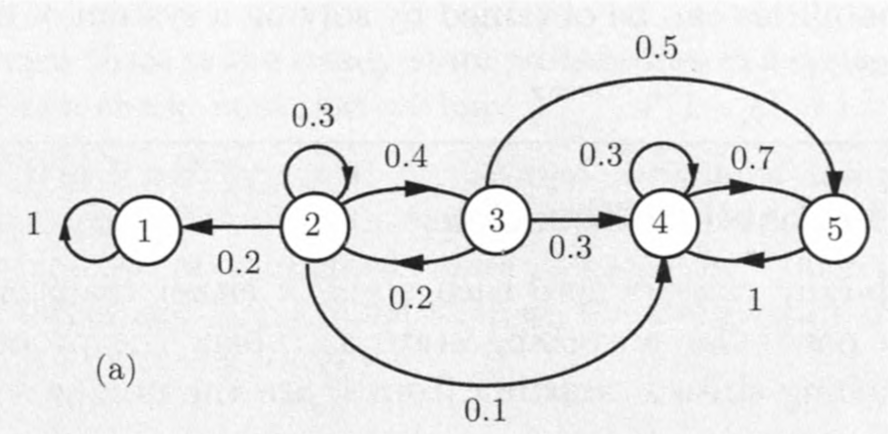
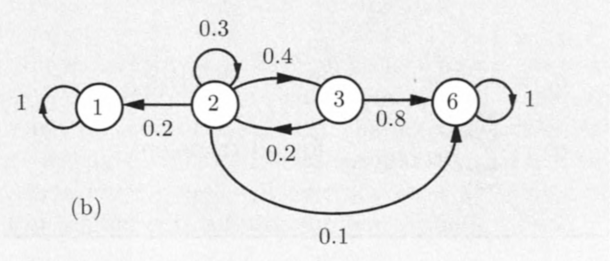
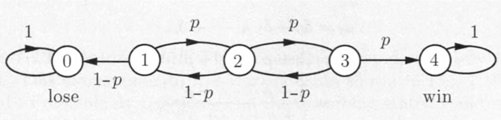
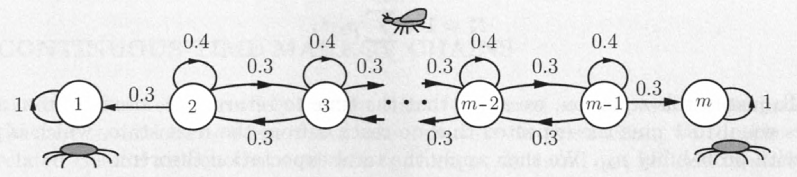

## Revisão

- Assuma uma cadeia de Markov com uma única classe recorrente de estados e aperiódica, e mais alguns estados transientes. Então,

$$
\lim_{n\rightarrow \infty}{p_{ij}^n} = \pi_j,
$$
\noindent em que $\pi_j$ não depende das condições iniciais:

$$
\lim_{n\rightarrow \infty}{\Pr(X_n = j | X_0 = i)} = \pi_j.
$$

## Revisão

- Ainda, note que

\begin{eqnarray*}
\Pr(X_n = j) &=& \sum_{k = 1}^m{\Pr(X_n = j | X_0 = k)}\\
&=& \sum_{k = 1}^m{p_{ij}^n\Pr(X_0 = k)}.
\end{eqnarray*}

\noindent e tomando limite dos dos lados da equação, quando $n \rightarrow \infty$, temos que

## Revisão

\begin{eqnarray*}
\lim_{n\rightarrow \infty}{\Pr(X_n = j)} &=& \sum_{k = 1}^m{\lim_{n\rightarrow \infty}{[p_{ij}^n]}\Pr(X_0 = k)}  \\
&=&  \pi_j\sum_{k = 1}^m{\Pr(X_0 = k)}= \pi_j.
\end{eqnarray*}

### Conclusão

$X_0$ e $X_n$ são aproximadamente independentes para "$n$ grande".

## Revisão

- Por fim, $\pi_1, \pi_2, \ldots, \pi_m$ podem ser encontradas como a solução única das equações de balanço/equilíbrio:

\begin{eqnarray*}
\pi_j &=& \sum_{k=1}^m{\pi_k p_{kj}}, \ j = 1, \ldots, m.\\
1  &=& \sum_{k=1}^m{\pi_k}.
\end{eqnarray*}

###

Para cada estado desta cadeia, podemos concluir que

\begin{eqnarray*}
\pi_j &=& 0,\ \mbox{para todo}\ j\ \mbox{transiente},\\
\pi_j &>& 0,\ \mbox{para todo}\ j\ \mbox{recorrente}.
\end{eqnarray*}

## Probabilidades de absorção

- Neste momento, estamos interessados no comportamento a __curto prazo__ das cadeias de Markov.
    + Suponha que a cadeia começa em um estado transiente.
    + Estamos interessados no primeiro estado recorrente que é alcançado pela cadeia, bem como no tempo até que isso aconteça.
- O comportamento subsequente da cadeia de Markov é irrelevante.
    + Podemos focar apenas no caso em que todo estado recorrente é absorvente:

$$
p_{kk} = 1,\quad p_{kj} = 0,\quad \mbox{para todo}\ j\neq k.
$$

## Probabilidades de absorção

- Se existir um único estado absorvente $k$, então a probabilidade de estacionário é $\pi_k = 1$.
- Se existirem múltiplos estados absorventes, a probabilidade de um deles ser atingido ainda é 1, mas a identidade do estado absorvente a ser alcançado é aleatória e as probabilidades associadas devem depender do __estado inicial__.
- Vamos fixar um particular estado absorvente $s$, e considerar a __probabilidade de absorção__ $a_i$ que $s$ seja alacançado, começando de $i$:

$$
a_i = \Pr(X_n\ \mbox{eventualmente se torne igual ao estado absorvente}\ s | X_0 = i).
$$

## Probabilidades de absorção

### Equações de probabilidade de absorção

Considere uma cadeia de Markov em que cada estado é ou transiente ou absorvente, e fixe um particular estado absorvente $s$. Então, as probabilidades $a_i$ de eventualmente alcançar o estado $s$, começando de $i$, são a única solução das equações

\begin{eqnarray*}
a_s &=& 1,\\
a_i &=& 0,\quad \mbox{para todo estado absorvente}\ i\neq s,\\
a_i &=& \sum_{j=1}^m{p_{ij}a_j}, \quad \mbox{para todo}\ i\ \mbox{transiente}.
\end{eqnarray*}

## Probabilidades de absorção

- As equações $a_s = 1$, e $a_i = 0$ para todo estado absorvente $i\neq s$, são evidentes a partir da definição de $a_i$.
- Para verificar as equações restantes, considere o evento $A$ ser o estado $s$ eventualmente é alcançado. Nós temos que

\begin{eqnarray*}
a_i &=& \Pr(A | X_0 = i)\\
    &=& \sum_{j=1}^m{\Pr(A | X_0 = i, X_1 = j)\times \Pr(X_1 = j | X_0 = i)}\quad \mbox{(regra da prob. total)}\\
    &=& \sum_{j=1}^m{\Pr(A | X_1 = j) p_{ij}}\quad \mbox{(prop. markoviana)}\\
    &=& \sum_{j=1}^m{a_jp_{ij}}.
\end{eqnarray*}

## Exemplo

```{r echo=FALSE, fig.align='center', message=FALSE, warning=FALSE, out.width='70%', paged.print=FALSE}

```

- Na cadeia acima temos duas classes recorrentes: $\{1\}$ e $\{4,5\}$.
- Queremos calcular a probabilidade que a cadeia eventualmente entre na classe $\{4,5\}$ começando a partir de um estado transiente.

## Exemplo

- Como não nos interessa saber o comportamento após a cadeia ter entrado na classe $\{4,5\}$ (ou seja, não estamos interessados nas transições dentro da classe) podemos tratar a classe como um único estado absorvente (estado 6), e assim a cadeia de Markov apresenta as condições necessárias para calcularmos as probabilidades de eventualmente entrar em 6.

```{r echo=FALSE, fig.align='center', message=FALSE, warning=FALSE, out.width='70%', paged.print=FALSE}

```

## Exemplo

- As probabilidades $a_i$ de eventualmente alcançar o estado absorvente $s = 6$ começando do estado $i$ satisfazem as seguintes equações:

\begin{eqnarray*}
a_2 = 0,2a_1 + 0,3a_2 + 0,4a_3 + 0,1a_6,\\
a_3 = 0,2a_2 + 0,8a_6.
\end{eqnarray*}

## Exemplo

- Usando o fato que $a_1 = 0$ e $a_6 = 1$, obtemos

\begin{eqnarray*}
a_2 = 0,3a_2 + 0,4a_3 + 0,1,\\
a_3 = 0,2a_2 + 0,8.
\end{eqnarray*}

- Resolvendo o sistema de equações encontramos $a_2 = 21/31$ e $a_3 = 29/31$

## Exemplo (a ruína do jogador)

- Considere um jogador que __ganha__ \$1 em cada rodada com probabilidade $p$, e __perde__ \$1 com probabilidade $1 - p$.
    + Diferentes rodadas são assumidas independentes.
    + O jogador joga continuamente  até que este acumule um montante \$_m_, ou perca todo o seu dinheiro.
- Qual a probabilidade de eventualmente ganhar o montante \$_m_?

## Exemplo (a ruína do jogador)

- Introduzimos a seguinte cadeia de Markov, em que $i = 0$ e $i = m$ representam __perder toda a fortuna__ e __ganhar o montante__, respectivamente.

```{r echo=FALSE, fig.align='center', message=FALSE, warning=FALSE, out.width='70%', paged.print=FALSE}

```

- Todos os estados são transientes, exceto os estados __perde tudo__ e __ganha o grande prêmio__.
    + Podemos encontrar as porbabilidades de absorção para $s = m$.
    
## Exemplo (a ruína do jogador)

- Seja $s = m$ e $a_i$ são as probabilidades de ganhar o montante começando com uma fortuna $i$).
- As probabilidades satisfazem

\begin{eqnarray*}
a_0 &=& 0, \\
a_i &=& (1 - p)a_{i-1} + pa_{i+1},\ i = 1, \ldots, m-1 \\
a_m &=& 1.
\end{eqnarray*}

- Podemos reescrever as equações da seguinte forma

\begin{eqnarray*}
a_i - pa_i &=& (1 - p)a_{i-1} + pa_{i+1} - pa_i,\\
(1 - p)(a_i - a_{i-1})  &=&  p(a_{i+1} - a_i),\ i = 1, \ldots, m-1.
\end{eqnarray*}

## Exemplo (a ruína do jogador)

- Denote

$$
\delta_i = a_{i+1} - a_i,\ i = 0, \ldots, m-1,
$$

\noindent e

$$
\rho = \frac{1 - p}{p},
$$

\noindent as equações são escritas como

$$
\delta_i = \rho\delta_{i-1},\ i = 1, \ldots, m-1,
$$

\noindent do qual nós obtemos

$$
\delta_i = \rho\delta_{i-1} = \rho(\rho\delta_{i-2}) = \ldots = \rho^i\delta_0,\ i = 1, \ldots, m-1.
$$

## Exemplo (a ruína do jogador)

- Isto, junto com a equação 

\begin{eqnarray*}
\sum_{i = 1}^m{\delta_{i-1}} &=& \delta_0 + \delta_1 + \ldots + \delta_{m-1} \\
 &=& (a_1 - a_0) + (a_2 - a_1) + \ldots + (a_m - a_{m-1})\\
 &=& a_m - a_0 = 1,
\end{eqnarray*}

\noindent implica

$$
1 = \delta_0 + \delta_1 + \ldots + \delta_{m-1} = \delta_0(1 + \rho + \ldots + \rho^{m-1}),\ \mbox{(pois}\ \delta_i = \rho^i\delta_0\mbox{)},
$$

\noindent e

$$
\delta_0 = \frac{1}{(1 + \rho + \ldots + \rho^{m-1})}.
$$

## Exemplo (a ruína do jogador)

- Como $a_0 = 0$ e $a_{i+1} = a_i + \delta_i$, então

\begin{eqnarray*}
a_i &=& a_{i-1} + \delta_{i-1} \\
 &=& a_{i-2} + \delta_{i-2} + \delta_{i-1} \\
 &=& \ldots \\
 &=& a_0 + \delta_0 + \delta_1 + \ldots + \delta_{i-1} \\
 &=& \delta_0 + \delta_1 + \ldots + \delta_{i-1}\\
 &=& \delta_0 + \rho\delta_0 + \ldots + \rho^{i-1}\delta_0\\
 &=& \delta_0(1 + \rho + \ldots + \rho^{i-1})\\
 &=& \frac{1 + \rho + \ldots + \rho^{i-1}}{1 + \rho + \ldots + \rho^{m-1}}
\end{eqnarray*}

## Exemplo (a ruína do jogador)

- Estas últimas simplificam em

$$
a_i = \left\{\begin{array}{ll}
\frac{1 - \rho^i}{1 - \rho^m},& \mbox{se}\ \rho\neq 1\\
\frac{i}{m},& \mbox{se}\ \rho = 1
\end{array}\right.
$$

### Conclusão

- Se $\rho > 1$ ($p < 1/2$), então $a_i\rightarrow 0$ conforme $m \rightarrow \infty$.
    + Em outras palavras, __grande prêmio__ $\Rightarrow$ __grande ruína__.

## Exemplo (a ruína do jogador)

### Para casa

- Fixe $m$ e $i$.
    + Estudo o comportamento de $a_i$ conforme varia $p$.
- Fixe $p$ e $i$.
    + Estudo o comportamento de $a_i$ conforme varia $m$.

Pode usar o `R`.

## Exemplo (a ruína do jogador)

```{r echo=FALSE, fig.align='center', message=FALSE, warning=FALSE, out.width='60%', paged.print=FALSE}

```

## Tempo esperado para absorção

- Agora voltamos nossa atenção para o __número esperado de passos__ até que um estado recorrente seja inserido (um evento que nos referimos como "absorção"), começando de um estado transiente em particular.
- Para qualquer estado $i$, nós denotamos

\begin{eqnarray*}
\mu_i &=& \E[\mbox{número de transições até a absorção, começando de } i]\\
&=& \E[\min\{n\geq 0 ; X_n\ \mbox{é recorrente}\} | X_0 = i]
\end{eqnarray*}

- Note que se $i$ é recorrente, então $\mu_i = 0$ de acordo com esta definição.

## Tempo esperado para absorção

- Podemos derivar equações para o $\mu_i$ usando a __lei das esperanças iteradas__.
- Argumentamos que o tempo de absorção a partir de um estado transitório $i$ é igual a $1$ mais o tempo esperado para absorção a partir do próximo estado, que é $j$ com probabilidade $p_{ij}$.
- Em seguida, obtemos um sistema de equações lineares, indicado a seguir, que é conhecido por ter uma solução única.

## Tempo esperado para absorção

### Equações para o tempo esperado para absorção

Os tempos esperados para absorção, $\mu_1, \ldots, \mu_m$, são a solução única para as equações

\begin{eqnarray*}
\mu_i &=& 0,\quad \mbox{para todo estado recorrente}\ i,\\
\mu_i &=& 1 + \sum_{j=1}^m{p_{ij}\mu_j}, \quad \mbox{para todo estado transiente}\ i.
\end{eqnarray*}

## Exemplo (mosca e aranhas)

- Considere mais uma vez a cadeia da mosca e das aranhas.

```{r echo=FALSE, fig.align='center', message=FALSE, warning=FALSE, out.width='70%', paged.print=FALSE}

```

- Vamos calcular o __número de passos até a mosca ser capturada__.

## Exemplo (mosca e aranhas)

- Temos $\mu_1 = \mu_m = 0$, e

$$
\mu_i = 1 + 0,3\mu_{i-1} + 0,4\mu_i + 0,3\mu_{i+1},\ i = 2, 3, \ldots, m-1.
$$

Seja $m = 5$, as equações se reduzem a

\begin{eqnarray*}
\mu_2 &=& 1 + 0,4\mu_2 + 0,3\mu_3\\
\mu_3 &=& 1 + 0,3\mu_2 + 0,4\mu_3 + 0,3\mu_4\\
\mu_4 &=& 1 + 0,3\mu_3 + 0,4\mu_4
\end{eqnarray*}

## Exemplo (mosca e aranhas)

Note que, $\mu_2  = \mu_4 = 10/6 + (1/2)\mu_3$, e substituindo, temos

\begin{eqnarray*}
\mu_2 &=& 5\\
\mu_3 &=& 20/3 \approx 6,67\\
\mu_4 &=& 5
\end{eqnarray*}

## Exemplo (mosca e aranhas) - via simulação

\tiny

Começando de 3

```{r echo=TRUE, eval=TRUE, warning=FALSE, message=FALSE}
Sim_CM_MA <- function(x0 = 3, probt = c(0.3, 0.4, 0.3)) {
  x <- x0
  n <- 0
  xj <- sample(
    x = c(2, 3, 4),
    size = 1,
    prob = probt
  )
  x <- c(x, xj)
  n <- n + 1
  repeat {
    xj <- sample(
      x = c(xj - 1, xj, xj + 1),
      size = 1,
      prob = probt
    )
    x <- c(x, xj)
    n <- n + 1
    if (x[n - 1] == 1 | x[n - 1] == 5) break
  }
  return(list(passos = n - 2, n = n - 1, x = x[1:(n - 1)]))
}

Sim_CM_MA()
```

## Exemplo (mosca e aranhas) - via simulação

Uma realização do passeio

```{r echo=FALSE, fig.align='center', message=FALSE, warning=FALSE, out.width='85%'}
set.seed(340717)
x.list <- Sim_CM_MA()
plot(0:(x.list$n - 1),
  x.list$x,
  type = "b",
  pch = 16,
  xlab = expression(n),
  ylab = expression(X[n]),
  col = "steelblue",
  axes = FALSE,
  lwd = 2
)
points((x.list$n - 1),
  x.list$x[x.list$n],
  pch = 16,
  col = "red"
)
axis(1, at = 0:(x.list$n - 1))
axis(2, at = x.list$x)
```

## Exemplo (mosca e aranhas) - via simulação

Outra realização possível do passeio

```{r echo=FALSE, fig.align='center', message=FALSE, warning=FALSE, out.width='85%'}
x.list <- Sim_CM_MA()
plot(0:(x.list$n - 1),
  x.list$x,
  type = "b",
  pch = 16,
  xlab = expression(n),
  ylab = expression(X[n]),
  col = "steelblue",
  axes = FALSE,
  lwd = 2
)
points((x.list$n - 1),
  x.list$x[x.list$n],
  pch = 16,
  col = "red"
)
axis(1, at = 0:(x.list$n - 1))
axis(2, at = x.list$x)
```

## Exemplo (mosca e aranhas) - via simulação

E mais outra realização possível do passeio

```{r echo=FALSE, fig.align='center', message=FALSE, warning=FALSE, out.width='85%'}
x.list <- Sim_CM_MA()
plot(0:(x.list$n - 1),
  x.list$x,
  type = "b",
  pch = 16,
  xlab = expression(n),
  ylab = expression(X[n]),
  col = "steelblue",
  axes = FALSE,
  lwd = 2
)
points((x.list$n - 1),
  x.list$x[x.list$n],
  pch = 16,
  col = "red"
)
axis(1, at = 0:(x.list$n - 1))
axis(2, at = x.list$x)
```

## Exemplo (mosca e aranhas) - via simulação

- Considere agora a realização de $M = 100000$ realizações desta cadeia de Markov.
- Em cada realização, você anota o número de passos (o tamanho, tempo) do passeio.
    + Você terá uma amostra do número de passos do passeio.
- Agora calcule a média desta amostra.

```{r echo=TRUE, eval=TRUE, warning=FALSE, message=FALSE, cache=TRUE}
passos <- c()
for (i in 1:100000) {
  x.list <- Sim_CM_MA()
  passos[i] <- x.list$passos
}
```

## Exemplo (mosca e aranhas) - via simulação

```{r echo=TRUE, eval=TRUE, warning=FALSE, message=FALSE, cache=TRUE}
# média amostral da variável
#   número de passos até a captura
mean(passos)
```

- Ou seja, `r round(mean(passos),2)` $= \hat{\mu}_3 \approx \mu_3 = 20/3 \approx 6,67$.

## Próxima aula

- Exercícios.

## Bons estudos! Bom feriado!

```{r echo=FALSE, fig.align='center', message=FALSE, warning=FALSE, out.width='90%', out.height='80%', paged.print=FALSE}

```