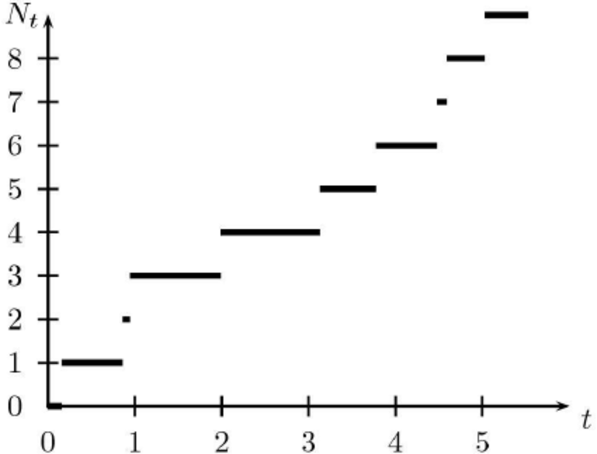

## Média dos tempos de primeira passagem e recorrência

- A ideia usada para calcular o tempo esperado para a absorção também pode ser usada para calcular o tempo esperado para atingir um estado recorrente específico, começando de qualquer outro estado.
- Por simplicidade, consideramos uma cadeia de Markov com uma única classe recorrente.
- Nós nos concentramos em um estado recorrente específico $s$, e denotamos por $t_i$ o __tempo médio da primeira passagem__ do estado $i$ para o estado $s$, definido por

\scriptsize
\begin{eqnarray*}
t_i &=& \E[\mbox{número de transições para alcançar}\ s\ \mbox{pela primeira vez, a partir de}\ i]\\
&=& \E[\min\{n \geq 0 ; X_n = s\} | X_0 = i].
\end{eqnarray*}

## Média dos tempos de primeira passagem e recorrência

- As transições fora do estado $s$ são irrelevantes para o cálculo dos tempos médios da primeira passagem.
- Podemos, portanto, considerar uma nova cadeia de Markov idêntica à original, exceto que o estado específico $s$ é convertido em um estado absorvente (definindo $p_{ss} = 1$ e $p_{sj} = 0$ para todo $j \neq s$).
- Com essa transformação, todos os estados, exceto $s$, se tornam transitórios.
- Em seguida, calculamos $t_i$ como o __número esperado de passos para absorção__ a partir de $i$ (usando as fórmulas fornecidas anteriormente).
- Nós temos

\begin{eqnarray*}
t_i &=& 1 + \sum_{j=1}^m{p_{ij}t_j}, \quad \mbox{para todo}\ i \neq s.\\
t_s &=& 0.
\end{eqnarray*}

## Média dos tempos de primeira passagem e recorrência

- Este sistema de equações lineares pode ser resolvido para os desconhecidos $t_i$, e tem uma solução única.
- As equações acima fornecem o tempo esperado para alcançar o estado específico $s$ a partir de qualquer outro estado. 

## Média dos tempos de primeira passagem e recorrência

- Podemos também querer calcular o __tempo médio de recorrência__ do estado específico $s$, que é definido como

\scriptsize
\begin{eqnarray*}
t_s^{*} &=& \E [\mbox{número de transições até o primeiro retorno a}\ s,\ \mbox{a partir de}\ s]\\
&=& \E [\min\{n \geq 1; X_n = s\} | X_0 = s].
\end{eqnarray*}

## Média dos tempos de primeira passagem e recorrência

Podemos obter $t_s^{*}$, uma vez que temos os primeiros tempos de passagem $t_i$, usando a equação
$$
t_s^{*} = 1 + \sum_{j=1}^m{p_{sj}t_j}
$$

- Para justificar esta equação, argumentamos que o tempo para retornar a $s$, partindo de $s$, é igual a $1$ mais o tempo esperado para alcançar $s$ a partir do próximo estado, que é $j$ com probabilidade $p_{sj}$.
- Em seguida, aplicamos o teorema da valor esperado total (lei das esperanças iteradas).

## Exemplo (Alice no país das probabilidades)

- Considere o modelo em que Alice, a cada semana, está "em dia" - "atrasada" com seus estudos de probabilidade.
- Os estados $1$ e $2$ correspondem a estar "em dia" e "atrasada"", respectivamente, e as probabilidades de transição são

\begin{eqnarray*}
p_{11} = 0,8,\ p_{12} = 0,2,\\
p_{21} = 0,6,\ p_{22} = 0,4. 
\end{eqnarray*}

## Exemplo (Alice no país das probabilidades)

- Vamos nos concentrar no estado $s = 1$ e calcular o tempo médio da primeira passagem para o estado $1$, começando do estado $2$.
- Temos $t_1 = 0$ e

$$
t_2 = 1 + p_{21}t_1 + p_{22}t_2 = 1 + 0,4t_2. 
$$
do qual

$$
t_2 = \frac{1}{0,6} = \frac{5}{3}.
$$

## Exemplo (Alice no país das probabilidades)

- O tempo médio de recorrência para o estado $1$ é dado por

$$
t_1^{*} = 1 + p_{11}t_1 + p_{12}t_2 = 1 + 0 + 0,2 \times\frac{5}{3} = \frac{4}{3}. 
$$

## Média dos tempos de primeira passagem e recorrência

### Equações para os tempos médios de primeira passagem e recorrência

Considere uma cadeia de Markov com uma única classe recorrente, e seja $s$ um estado recorrente particular.

- Os tempos médios de primeira passagem $t_i$ para alcança o estado $s$ a partir de $i$ são a solução única do sistema de equações

$$
t_s = 0,\quad t_i = 1 + \sum_{j=1}^m{p_{ij}t_j},\quad\mbox{para todo}\ i\neq s.
$$

- O tempo médio de recorrência $t_s^{*}$ do estado $s$ é dado por

$$
t_s^{*} =  1 + \sum_{j=1}^m{p_{sj}t_j}.
$$

## Exercício

- Considere a cadeia do clima, e que começamos o processo em um "dia chuvoso".

```{r, echo=FALSE, eval=TRUE, warning=FALSE, message=FALSE}
library(mat2tex)

# matriz de probabilidades de transição
# da cadeia de Markov da Mosca e as Aranhas
# com 4 estados

pt.clima <- matrix(c(0.4, 0.6, 0,
                     0.2, 0.5, 0.3,
                     0.1, 0.7, 0.2),
                   nrow = 3,
                   ncol = 3,
                   byrow = TRUE)
```

```{r, echo=FALSE, eval=TRUE, warning=FALSE, message=FALSE, results='asis'}
"$$ P = " %_% xm(pt.clima, 1) %_% "$$"
```
                   
- Calcule o tempo médio da primeira passagem pelo estado "dia ensolarado".
- Calcule o tempo médio de recorrência para o estado "dia chuvoso".

## Para casa

- Ler o capítulo 1.11 do Durrett.

## Próxima aula

- Processos estocásticos em tempo contínuo.
- O processo de Poisson.

## Bons estudos!

```{r echo=FALSE, fig.align='center', message=FALSE, warning=FALSE, out.width='90%', out.height='80%', paged.print=FALSE}

```