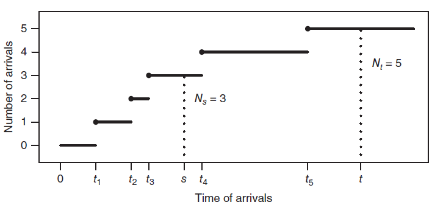
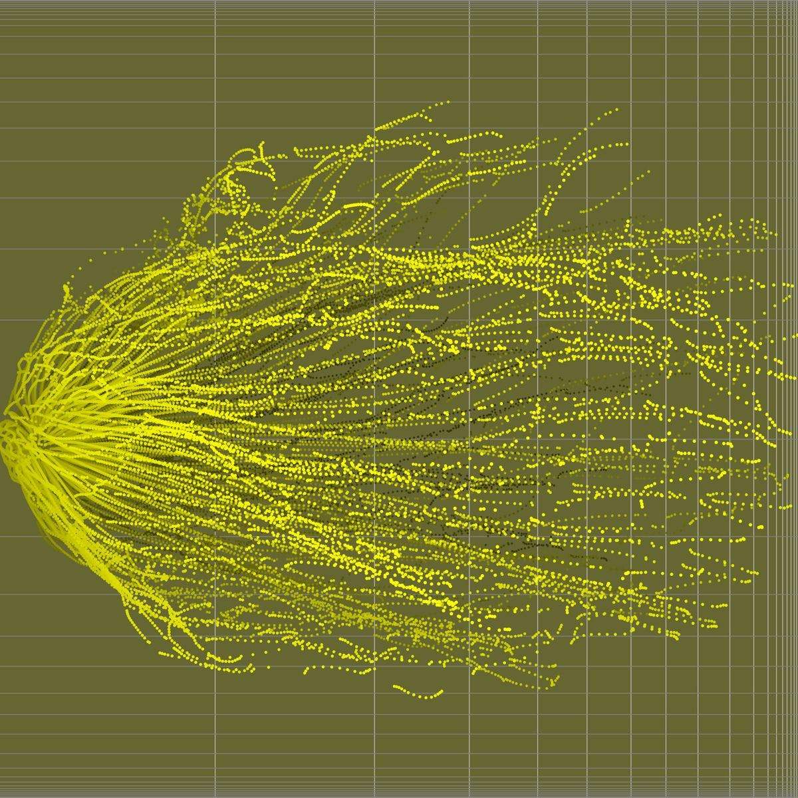

## Introdução

- Mensagens de texto chegam em seu celular em horários irregulares ao longo do dia.
- Acidentes ocorrem na rodovia em uma distribuição aparentemente aleatória de tempo e lugar.
- Crianças nascem em momentos aleatórios em uma maternidade.
- Casos de gripe são notificados no estado do RS em um inverno.
- Falhas em um sistema de energia ocorrem de maneira incerta ao longo do tempo.

## Introdução

- Todos esses fenômenos são bem modelados pelo __processo de Poisson__, um processo estocástico usado para modelar a __ocorrência__ ou __chegada de eventos__ em um __intervalo contínuo__.
    + Normalmente, o intervalo representa o tempo.
- Um processo de Poisson é um tipo especial de __processo de contagem__.
- Dado um fluxo de eventos que chegam em tempos aleatórios começando em $t = 0$, deixe $N_t$ denotar o __número__ de chegadas que ocorrem pelo tempo $t$, isto é, o número de eventos em $[0, t]$.
    + Por exemplo, $N_t$ pode ser o número de mensagens de texto recebidas até o momento $t$.
    + $N$ é chamada a __variável aleatória de contagem__.

## Introdução

- Para cada $t \geq 0$, $N_t$ é uma variável aleatória.
- A coleção de variáveis aleatórias $\{N_t; t \geq 0\}$ é __um processo estocástico em tempo contínuo__, que assume valores nos inteiros, denominado processo de contagem.
- Como $N_t$ conta eventos em $[0, t]$, quando $t$ aumenta, o número de eventos $N_t$ aumenta.

## Introdução

\begin{block}{Processo de contagem}
Um processo de contagem $\{N_t; t \geq 0\}$ é uma coleção de variáveis aleatórias não negativas, com valores inteiros, de tal forma que se $0 \leq s \leq t$, então $N_s \leq N_t$.
\end{block}

- Ao contrário de uma cadeia de Markov, que é uma __sequência__ de variáveis aleatórias, um processo de contagem forma uma coleção incontável, já que é indexado por um intervalo de tempo contínuo.

- Os processos de contagem ganham especial relevância (teórica e prática) nas áreas de __análise de sobrevivência__ e __confiabilidade de sistemas__ (\textcolor{blue}{eventos recorrentes}).

## Processo de contagem

- A Figura abaixo mostra o caminho de um processo de contagem no qual os eventos ocorrem nos tempos $t_1, t_2, t_3, t_4, t_5$.

```{r echo=FALSE, fig.align='center', message=FALSE, warning=FALSE, out.width='70%', paged.print=FALSE}

```

- O caminho de um processo de contagem é uma __função escada contínua à direita__.
- Se $0 \leq s \leq t$, então $N_t - N_s$ é o número de eventos no intervalo $(s, t)$.

## Processo de Poisson

- __Observação:__ em nossa discussão do processo de Poisson, usamos a palavra __evento__ em um sentido genérico e não no sentido rigoroso da teoria da probabilidade, em que um evento é um subconjunto do espaço amostral.
- Existem várias maneiras de caracterizar o processo de Poisson.
- Podemos focar em
    i. o número de eventos que ocorrem em intervalos fixos;
    ii. quando ocorrem eventos e os tempos entre esses eventos;
    iii. o comportamento probabilístico de eventos individuais em intervalos infinitesimais.
- Isso leva a três definições equivalentes de um processo de Poisson, cada uma das quais fornece percepções especiais sobre o modelo estocástico.

## Processo de Poisson

\begin{block}{Processo de Poisson - Definição 1}
Um processo de Poisson com parâmetro $\lambda$ é processo de contagem $\{N_t; t \geq 0\}$ com as seguintes propriedades:
\begin{enumerate}
\item $N_0 = 0$.
\item Para todo $t > 0$, $N_t$ tem uma distribuição de Poisson com parâmetro $\lambda t$.
\item (Incrementos estacionários) Para todo $s, t > 0$, $N_{t+s} - N_s$ tem a mesma distribuição que $N_t$. Ou seja,
$$
\Pr(N_{t+s} - N_s = k) = \Pr(N_t = k) = \frac{e^{-\lambda t}(\lambda t)^k}{k!}, k = 0, 1, \ldots
$$
\item (Incrementos independentes) Para $0 \leq q < r \leq s < t$, $N_t - N_s$ e $N_r - N_q$ são variáveis aleatórias independentes.
\end{enumerate}
\end{block}

## Processo de Poisson

### Comentários

- A propriedade de incrementos estacionários diz que a distribuição do número de chegadas em um intervalo depende apenas da comprimento do intervalo (e não do "momento/localização" do intervalo).
- A propriedade de incrementos independentes diz que o número de chegadas em intervalos disjuntos são variáveis aleatórias independentes.
- Como $N_t$ tem uma distribuição de Poisson, $\E[N_t] = \lambda t$. Isto é, __esperamos__ cerca de $\lambda t$ chegadas em unidades de tempo. Assim, a __taxa de chegadas__ é $\E[N_t]/t = \lambda$.

## Exemplo

- A partir das 6h da manhã, os clientes chegam à padaria da Martha de acordo com um processo de Poisson a uma taxa de 30 clientes por hora.
- Encontre a probabilidade de que mais de 65 clientes cheguem entre 9 e 11 da manhã.

## Exemplo

- Seja $t = 0$ representa 6h da manhã.
- Então, a probabilidade desejada é $\Pr(N_5 - N_3 > 65)$.
- Por incrementos estacionários, temos

\begin{eqnarray*}
\Pr(N_5 - N_3 > 65) &=& \Pr(N_2 > 65)\\
&=& 1 - \Pr(N_2 \leq 65)\\
&=& 1 - \sum_{k=0}^{65}{\Pr(N_2 = k)}\\
&=& 1 - \sum_{k=0}^{65}{\frac{e^{-(30\times 2)}(30\times 2)^k}{k!}} = 0,2355.
\end{eqnarray*}

## Exemplo

```{r, echo=TRUE, eval=TRUE, warning=FALSE, message=FALSE}
1 - ppois(q = 65, lambda = (30 * 2))
ppois(q = 65, lambda = (30 * 2), lower.tail = FALSE)
```

## Exemplo 2

- Joe recebe mensagens de texto a partir das 10h da manhã, a uma taxa de 10 mensagens por hora, de acordo com um processo de Poisson.
- Encontre a probabilidade de ele receber exatamente 18 mensagens ao meio-dia e 70 mensagens às 17h.

## Exemplo 2

- A probabilidade desejada é $\Pr(N_2 = 18, N_7 = 70)$, com o tempo como horas.
- Se 18 mensagens chegam no intervalo $[0, 2]$ e 70 mensagens chegam em $[0, 7]$, então há $70 - 18 = 52$ mensagens em $(2, 7]$. Ou seja,

$$
\{N_2 = 18, N_7 = 70\} = \{N_2 = 18, N_7 - N_2  = 52\}.
$$

## Exemplo 2

- Os intervalo $[0, 2]$ e $(2, 7]$ são disjuntos, e assim, temos

\begin{eqnarray*}
\Pr(N_2 = 18, N_7 = 70) &=& \Pr(N_2 = 18, N_7 - N_2  = 52)\\
 &=& \Pr(N_2 = 18) \Pr(N_7 - N_2  = 52)\ \mbox{\textcolor{red}{(por que?)}}\\
 &=& \Pr(N_2 = 18) \Pr(N_5  = 52)\ \mbox{\textcolor{red}{(por que?)}}\\
 &=& \left[\frac{e^{-(10 \times 2)}(10 \times 2)^{18}}{18!}\right] \times \left[\frac{e^{-(10 \times 5)}(10 \times 5)^{18}}{52!}\right]\\
 &=& 0,0045.
\end{eqnarray*}

## Exemplo 2

- Os intervalo $[0, 2]$ e $(2, 7]$ são disjuntos, e assim, temos

\begin{eqnarray*}
\Pr(N_2 = 18, N_7 = 70) &=& \Pr(N_2 = 18, N_7 - N_2  = 52)\\
 &=& \Pr(N_2 = 18) \Pr(N_7 - N_2  = 52)\ \mbox{\textcolor{blue}{(increm. indep.)}}\\
 &=& \Pr(N_2 = 18) \Pr(N_5  = 52)\ \mbox{\textcolor{blue}{(increm. estac.)}}\\
 &=& \left[\frac{e^{-(10 \times 2)}(10 \times 2)^{18}}{18!}\right] \times \left[\frac{e^{-(10 \times 5)}(10 \times 5)^{52}}{52!}\right]\\
 &=& 0,0045.
\end{eqnarray*}

```{r, echo=TRUE, eval=TRUE, warning=FALSE, message=FALSE}
dpois(x = 18, lambda = 10*2)*dpois(x = 52, lambda = 10*5)
```

## Exemplo 2

### Comentário

- Não é verdade que $N_7 - N_2 = N_5$.
- O número de chegadas em $(2, 7)$ não é necessariamente igual ao número de chegadas em $(0, 5)$.
- O que é verdade é que a __distribuição__ de $N_7 - N_2$ __é igual à distribuição__ de $N_5$.
    + $N_7 - N_2 \stackrel{D}{=} N_5$.
- Note que enquanto $N_7 - N_2$ é independente de $N_2$ (\textcolor{red}{por que?}), a variável aleatória $N_5$ __não é independente__ de $N_2$ (\textcolor{red}{por que?}).
    + Ainda, $N_5 \geq N_2$ (\textcolor{red}{por que?}).

## Processo de Poisson transladado

- Seja $\{N_t; t \geq 0\}$ um processo de Poisson com parâmetro $\lambda$.
- Para um tempo fixo $s > 0$, considere o processo transladado $\{N_{t + s} - N_s; t \geq 0\}$.
- O processo transladado __é probabilisticamente equivalente__ ao processo original.

## Processo de Poisson transladado

### O processo de Poisson transladado é um processo de Poisson

Seja $\{N_t; t \geq 0\}$ um processo de Poisson com parâmetro $\lambda$. Para $s > 0$, seja

$$
\tilde{N}_t = N_{t + s} - N_s,\ \mbox{para}\ t \geq 0.
$$

Então, $\{\tilde{N}_t; t \geq 0\}$ é um processo de Poisson com parâmetro $\lambda$.

## Processo de Poisson transladado

### Comentários

- Temos que $\{\tilde{N}_t; t \geq 0\}$ é um processo de contagem com $\tilde{N}_0 = N_s - N_s = 0$.
- Por incrementos estacionários, $\tilde{N}_t$ tem a mesma distribuição que $N_t$.
- O novo processo herda incrementos estacionários e independentes do original.
- Segue que se $N_s = k$, a distribuição de $N_{t + s} - k$ é igual à distribuição de $N_t$.

## Exercício

- No dia da eleição, as pessoas chegam a um centro de votação de acordo com um processo de Poisson.
    + Em média, 100 eleitores chegam a cada hora.
- Se 150 pessoas chegarem durante a primeira hora, qual é a probabilidade de que, no máximo, 350 pessoas cheguem antes da terceira hora?

## Para casa

- Ler o capítulo 2.1 do Durrett (distribuição exponencial).

## Próxima aula

- O processo de Poisson.
    + Tempos de chegadas e tempos entre-chegadas.

## Bons estudos!

```{r echo=FALSE, fig.align='center', message=FALSE, warning=FALSE, out.width='100%', out.height='80%', paged.print=FALSE}

```