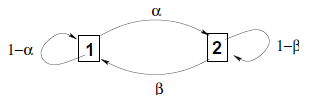

## Introdução

A importância das cadeias de Markov vem de dois fatos: 

- Há um grande número de fenômenos físicos, biológicos, econômicos e sociais que podem ser modelados dessa maneira.
- Há uma teoria bem desenvolvida que nos permite fazer cálculos.

## Cadeias de Markov em tempo discreto

- Vamos considerar __cadeias de Markov em tempo discreto__.
    + O estado muda em certos instantes de tempo discretos, indexados por um inteiro $n$.
- A cada passo $n$, o estado da cadeia é denotado por $X_n$ e pertence a um conjunto finito $S$ de estados possíveis, chamado de __espaço de estados__.
- Vamos assumir que $S = \{1,\ldots, m\}$, para algum inteiro positivo $m$.
- A cadeia de Markov é descrita em termos de suas __probabilidades de transição__ $p_{ij}$.
    + Sempre que o estado passa a ser $i$, existe probabilidade $p_{ij}$ de que o próximo estado seja igual a $j$. 

$$
p_{ij} = \Pr(X_{n+1} = j | X_n = i),\ i,j \in S.
$$

## Cadeias de Markov em tempo discreto

- O principal pressuposto subjacente às cadeias de Markov é que as probabilidades de transição $p_{ij}$ se aplicam sempre que o estado $i$ é visitado, não importando __o que__ aconteceu no passado, e não importando __como__ o estado $i$ foi alcançado.
- Matematicamente, *assumimos* a __propriedade de Markov__ (ou propriedade markoviana)

\begin{eqnarray*}
\Pr(X_{n+1} = j | X_n = i, X_{n-1} = i_{n-1}, \ldots, X_0 = i_0) &=&  \Pr(X_{n+1} = j | X_n = i)\\
&=& p_{ij},
\end{eqnarray*}
para todo tempo $n$, todos os estados $i,j \in S$, e todas as sequências possíveis $i_0,\ldots, i_{n-1}$ de estados anteriores.

- Assim, a lei de probabilidade do próximo estado $X_{n+1}$ depende do passado __apenas através do valor do estado atual__ $X_n$.

## Cadeias de Markov em tempo discreto

- As probabilidades de transição $p_{ij}$ devem ser obviamente não-negativas e somar um:

$$
\sum_{j=1}^m{p_{ij}} = 1,\ \mbox{para todo}\ i.
$$

- Geralmente, permitiremos que as probabilidades $p_{ii}$ sejam positivas, caso em que é possível que o próximo estado seja __o mesmo que o atual__.
- Mesmo que o estado não mude, ainda vemos isso como uma transição de estado (uma __"auto-transição"__).

## Cadeias de Markov em tempo discreto

### Especificação de modelos markovianos

- Uma cadeia de Markov é especificada por identificar:
    (a) o conjunto de estados $S = \{1,\ldots, m\}$;
    (b) o conjunto de possíveis transições, ou seja, os pares $(i,j)$ para os quais $p_{ij} > 0$;
    (c) os valores numéricos de $p_{ij}$ que são positivos.
- A cadeia de Markov especificada por este modelo é uma sequência de variáveis aleatórias $X_0, X_1, X_2,\ldots$ , que tomam valores em $S$ e satisfazem

$$
\Pr(X_{n+1} = j | X_n = i, X_{n-1} = i_{n-1}, \ldots, X_0 = i_0) = p_{ij},
$$
para todos os tempos $n$, todos os estados $i,j \in S$ e todas as sequências possíveis $i_0,\ldots, i_{n-1}$ de estados anteriores.

## Matriz de transição

Todos os elementos de um modelo de uma cadeia de Markov podem ser codificados em uma __matriz de probabilidade de transição__, que é simplesmente um arranjo bidimensional cujo elemento na $i$-ésima linha e $j$-ésima coluna é $p_{ij}$:

$$P = \left[
\begin{array}{cccc}
p_{11} & p_{12} & \cdots & p_{1m} \\
p_{21} & p_{22} & \cdots & p_{2m} \\
\vdots & \vdots & \vdots & \vdots \\
p_{m1} & p_{m2} & \cdots & p_{mm} \\
\end{array}
\right].
$$

## Diagrama de transição

- Também é útil dispor o modelo no chamado __diagrama de transições__.


```{r echo=FALSE, fig.align='center', message=FALSE, warning=FALSE, out.width='50%', paged.print=FALSE}

```

- Registrando os valores numéricos de $p_{ij}$ perto dos arcos correspondentes, pode-se visualizar todo o modelo de uma maneira que possa tornar algumas de suas principais propriedades prontamente aparentes.

## Exemplo I. Alice no País das Probabilidades

__Alice__ está fazendo um curso de probabilidade e __em cada semana__, ela pode estar __"em dia"__ ou ter __"ficado para trás"__.

- __Se ela estiver "em dia"__ em uma determinada semana, a probabilidade dela estar atualizada (ou atrasada) na próxima semana é de 0,8 (ou 0,2, respectivamente).
- __Se ela está atrasada__ na dada semana, a probabilidade dela estar atualizada (ou atrasada) na próxima semana é de 0,6 (ou 0,4, respectivamente).
- __Assumimos__ que essas probabilidades não dependem do fato de Alice estar atualizada ou atrasada nas semanas anteriores, portanto, o problema tem a típica característica de uma cadeia de Markov __(o futuro depende do passado apenas através do presente)__.

__Exercício:__ construa a matriz e o diagrama de probabilidades de transição.


## Exemplo II. Moscas e Aranhas

Uma mosca se move ao longo de uma linha reta em incrementos de unidade. 

- A cada período de tempo, ele move uma unidade para a esquerda com probabilidade de 0,3, uma unidade para a direita com probabilidade de 0,3 e permanece no local com probabilidade de 0,4, independente da história passada de movimentos.
- Duas aranhas estão à espreita nas posições $1$ e $m$: se a mosca pousar ali, ela é capturada por uma aranha e o processo termina.
- Queremos construir um modelo de cadeia de Markov, assumindo que a mosca começa em uma posição entre $1$ e $m$.
    + __Exercício 1:__ escreva as probabilidades de transição.
    + __Exercício 2:__ especifique $m = 4$ e construa a matriz e o diagrama de probabilidades de transição.


## Exemplo III. Falha, reparo e substituição da máquina

Uma máquina pode estar funcionando ou quebrada em um determinado dia.

- Se estiver funcionando, ele irá quebrar no próximo dia com probabilidade $b$, e continuará trabalhando com probabilidade $1 - b$.
- Se quebrar em um determinado dia, ele será reparada e estará trabalhando no dia seguinte com probabilidade $r$, e continuará quebrada com probabilidade $1- r$.
    + __Exercício 1:__ especifique o espaço de estados.
    + __Exercício 2:__ construa a matriz e o diagrama de probabilidades de transição.

## Exemplo III. Falha, reparo e substituição da máquina

- A situação considerada aqui evidentemente tem a propriedade Markov: o estado da máquina no dia seguinte depende explicitamente apenas de seu estado nos dias atuais.
- No entanto, é possível usar um modelo de cadeia de Markov, mesmo que haja uma dependência dos estados em alguns dias anteriores ao atual.
- A ideia geral é __introduzir alguns estados adicionais__ que codificam informações relevantes de períodos anteriores, como na variação que consideramos a seguir.

## Exemplo III. Falha, reparo e substituição da máquina

- Suponha que, sempre que a máquina permaneça quebrada por um determinado número de $\ell$ dias, apesar dos esforços de reparo, ela seja substituída por uma nova máquina em funcionamento.
- Para modelar este caso como uma cadeia de Markov, substituímos o estado 2, correspondente a uma máquina quebrada, com vários estados que indicam o número de dias que a máquina está quebrada.
- Esses estados são

$$
\mbox{Estado}\ (2,i): \mbox{a máquina esteve quebrada por } i \mbox{dias}, i = 1,2,\ldots,\ell.
$$

## Exemplo III. Falha, reparo e substituição da máquina

Diagrama de probabilidades de transição para $\ell = 4$. Uma máquina que permaneceu quebrada por 4 dias é substituída por uma nova máquina em funcionamento.

```{r echo=FALSE, fig.align='center', message=FALSE, warning=FALSE, out.width='90%', paged.print=FALSE}
knitr::include_graphics('images/falhas_reparos_diagrama.png')
```

## Exercício

- Construa uma cadeia de Markov considerando os estados: __"ensolarado"__, __"chuvoso"__ e __"nublado"__.

## A probabilidade de um caminho

- Dado um modelo de cadeia de Markov, podemos calcular a probabilidade de qualquer sequência particular de estados futuros (caminho).
    + Isso é análogo ao uso da __regra de multiplicação__ em modelos de probabilidade sequenciais (árvore).

$$
\Pr(X_0 = i_0, X_1 = i_1, \ldots, X_n = i_n) = \Pr(X_0 = i_0) p_{i_0i_1} p_{i_1i_2} \cdots p_{i_{n-1}i_n}.
$$

($\Pr(X_0 = x)$ é chamada de distribuição inicial da cadeia de Markov)


## A probabilidade de um caminho

- Para verificar esta propriedade, note que

\begin{eqnarray*}
&&\Pr(X_0=i_0, X_1 = i_1, \ldots, X_n = i_n) \\
&&= \Pr(X_n = i_n | X_0 = i_0, \ldots, X_{n-1} = i_{n-1})\times \Pr(X_0 = i_0, \ldots, X_{n-1} = i_{n-1})\\
&&= p_{i_{n-1}i_n}\Pr(X_0 = i_0, \ldots, X_{n-1} = i_{n-1}),
\end{eqnarray*}

em que última igualdade faz uso da propriedade markoviana.

- Em seguida, aplicamos o mesmo argumento ao termo $\Pr(X_0 = i_0, \ldots, X_{n-1} = i_{n-1})$ e continuamos de forma semelhante, até que finalmente obtemos a expressão desejada.

## A probabilidade de um caminho

Se o estado inicial é dado $X_0 = i_0$, um argumento similar produz

$$
\Pr(X_1 = i_1, \ldots, X_n = i_n | X_0 = i_0) = p_{i_0i_1} p_{i_1i_2} \cdots p_{i_{n-1}i_n}.
$$

- Graficamente, uma sequência de estados pode ser identificado com uma sequência de arcos do grafo de probabilidades de transição, e a probabilidade de um tal caminho (dado o estado inicial) é dado pelo __produto das probabilidades associadas com os arcos atravessados pelo caminho__.

## A probabilidade de um caminho

- __Exemplo (mosca e aranhas):__

$$
\scriptsize
\Pr(X_1 = 2, X_2 = 2, X_3 = 3, X_4 = 4 | X_0 = 2) = p_{22}p_{22}p_{23}p_{34} = (0,4)^2(0,3)^2.
$$

Também temos que

\begin{eqnarray*}
\scriptsize
\Pr(X_0 = 2, X_1 = 2, X_2 = 2, X_3 = 3, X_4 = 4) &=& \Pr(x_0 = 2) p_{22}p_{22}p_{23}p_{34} \\
&=& \Pr(x_0 = 2) (0,4)^2(0,3)^2.
\end{eqnarray*}

- No caso em que o estado inicial não é dado, é necessário especificarmos uma distribuição inicial para $X_0$, para que possamos calcular a probabilidade acima.

- __Exercício:__ calcule $\Pr(X_1 = 2, X_2 = 2, X_3 = 3, X_4 = 4 | X_0 = 2)$.

## Cenas dos próximos capítulos

- No __exemplo da mosca e das aranhas__,

$$
\Pr( X_4 = 4 | X_0 = 2) = ?
$$

- Ou seja, dado um estado inicial, qual a probabilidade de estarmos em um particular estado após um determinado período de tempo?

## Simulando uma cadeia de Markov

- Considere o exemplo __exemplo da mosca e das aranhas__ com $m = 5$ e suponha que a mosca começa o seu passeio perigoso no estado $X_0 =3$.
- Qual o tempo médio do passeio? Ou seja, quanto tempo, em média, leva para a mosca ser capturada por uma das aranhas?
- Ainda não conhecemos as técnicas para responder a esta pergunta.
    + Mas, podemos simular um passeio desta cadeia!

## Simulando uma cadeia de Markov

\tiny

```{r echo=TRUE, eval=TRUE, warning=FALSE, message=FALSE}
Sim_CM_MA <- function(x0 = 3, probt = c(0.3, 0.4, 0.3)) {
  x <- x0
  n <- 0
  xj <- sample(
    x = c(2, 3, 4),
    size = 1,
    prob = probt
  )
  x <- c(x, xj)
  n <- n + 1
  repeat{
    xj <- sample(
      x = c(xj - 1, xj, xj + 1),
      size = 1,
      prob = probt
    )
    x <- c(x, xj)
    n <- n + 1
    if (x[n - 1] == 1 | x[n - 1] == 5) break
  }
  return(list(n = n - 1, x = x[1:(n - 1)]))
}

Sim_CM_MA()
```

## Simulando uma cadeia de Markov

Uma realização do passeio

```{r echo=FALSE, fig.align='center', message=FALSE, warning=FALSE, out.width='85%'}
set.seed(530858)
x.list <- Sim_CM_MA()
plot(0:(x.list$n - 1),
  x.list$x,
  type = "b",
  pch = 16,
  xlab = expression(n),
  ylab = expression(X[n]),
  col = "steelblue",
  axes = FALSE
)
points((x.list$n - 1),
  x.list$x[x.list$n],
  pch = 16,
  col = "red"
)
axis(1, at = 0:(x.list$n - 1))
axis(2, at = x.list$x)
```

## Simulando uma cadeia de Markov

Outra realização possível do passeio

```{r echo=FALSE, fig.align='center', message=FALSE, warning=FALSE, out.width='85%'}
x.list <- Sim_CM_MA()
plot(0:(x.list$n - 1),
  x.list$x,
  type = "b",
  pch = 16,
  xlab = expression(n),
  ylab = expression(X[n]),
  col = "steelblue",
  axes = FALSE
)
points((x.list$n - 1),
  x.list$x[x.list$n],
  pch = 16,
  col = "red"
)
axis(1, at = 0:(x.list$n - 1))
axis(2, at = x.list$x)
```

## Simulando uma cadeia de Markov

E mais outra realização possível do passeio

```{r echo=FALSE, fig.align='center', message=FALSE, warning=FALSE, out.width='85%'}
x.list <- Sim_CM_MA()
plot(0:(x.list$n - 1),
  x.list$x,
  type = "b",
  pch = 16,
  xlab = expression(n),
  ylab = expression(X[n]),
  col = "steelblue",
  axes = FALSE
)
points((x.list$n - 1),
  x.list$x[x.list$n],
  pch = 16,
  col = "red"
)
axis(1, at = 0:(x.list$n - 1))
axis(2, at = x.list$x)
```

## Simulando uma cadeia de Markov

- Considere agora a realização de $M = 1000$ realizações desta cadeia de Markov.
- Em cada realização, você anota o número de passos (o tamanho, tempo) do passeio.
    + Você terá uma amostra do número de passos do passeio.
- Agora calcule a média desta amostra.

```{r echo=TRUE, eval=TRUE, warning=FALSE, message=FALSE}
n <- c()
for (i in 1:1000) {
  x.list <- Sim_CM_MA()
  n[i] <- x.list$n
}

mean(n)
```

## Simulando uma cadeia de Markov

```{r echo=FALSE, fig.align='center', message=FALSE, warning=FALSE, out.width='70%', out.height='70%', paged.print=FALSE}

```

## Um minuto história

\begin{columns}[c]
\column{1.3in}
\begin{figure}[!h]
\begin{center}
\includegraphics[width=0.9\columnwidth]{images/Andrei_Markov}
\end{center}
\end{figure}
\column{3.3in}
{\footnotesize
\begin{itemize}\setlength{\itemsep}{+2mm}
\item \structure{Andrei Andreyevich Markov (1856-1922)} foi um matemático russo.
\item Formou-se na Universidade Estatal de São Petersburgo em 1878, onde foi aluno de \structure{Pafnuti Tchebychev (1821-1894)}, e tornou-se professor em 1886.
\item Teve um filho, também matemático, e também chamado \structure{Andrei Andreyevich Markov (1903-1979)}!
\end{itemize}
}
\end{columns}

## Um minuto história

### Cadeia de Markov
__A. A. Markov__ fundou um novo ramo da teoria da probabilidade aplicando a matemática à poesia. Analisando o texto do romance de __Alexander Pushkin__ em verso __Eugene Onegin__, Markov passou horas analisando __padrões de vogais e consoantes__. Em 23 de janeiro de 1913, ele resumiu suas descobertas em um discurso à Academia Imperial de Ciências em São Petersburgo. Sua análise não alterou a compreensão ou apreciação do poema de Pushkin, mas a técnica que ele desenvolveu - agora conhecida como cadeia de Markov - ampliou a teoria da probabilidade em uma nova direção. A metodologia de Markov foi além do lançamento da moeda e de dados (onde cada evento é independente de todos os outros) para __cadeias de eventos vinculados__ (onde o que acontece a seguir depende do estado atual do sistema).

## Próxima aula

- Probabilidades de transição em $n$-passos
- Equação de Chapman-Kolmogorov

## Bons estudos!

```{r echo=FALSE, fig.align='center', message=FALSE, warning=FALSE, out.width='60%', paged.print=FALSE}

```