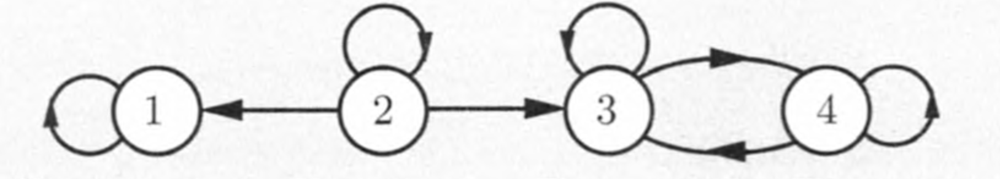
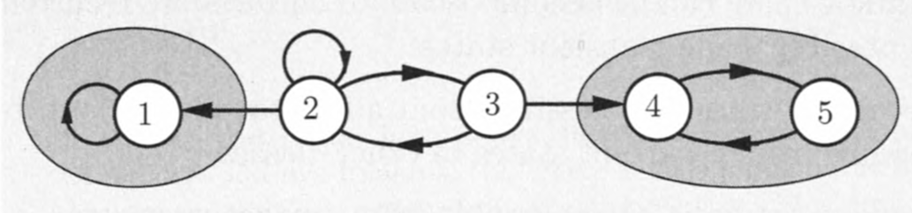
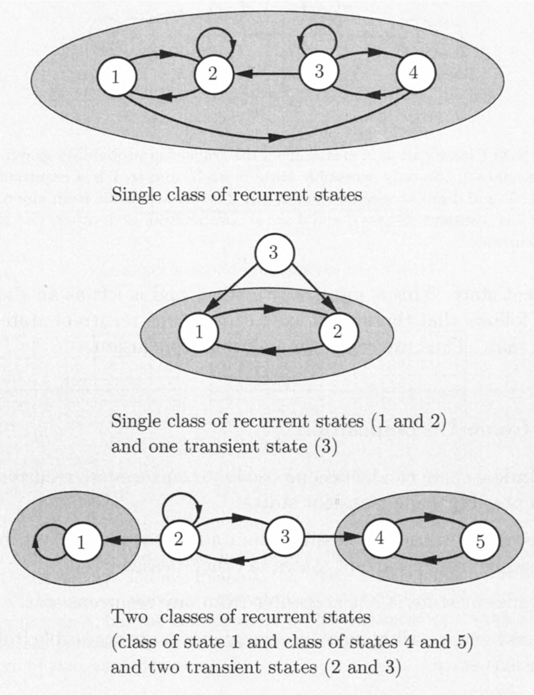
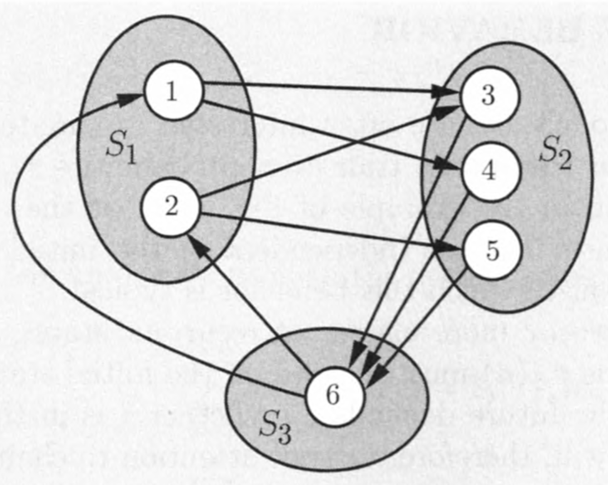
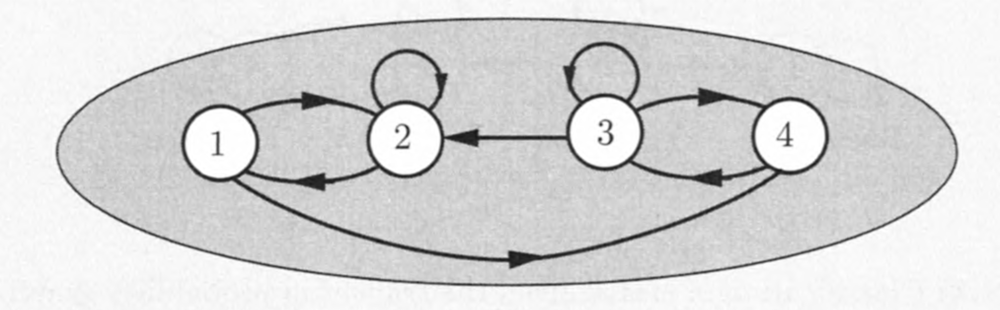
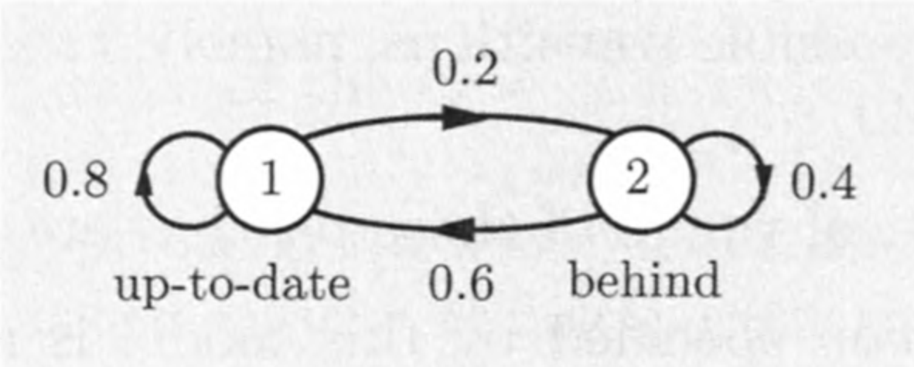

## Revisão

### Cadeias de Markov em tempo discreto

- Uma cadeia de Markov é especificada por identificar:
    (a) o conjunto de estados $S = \{1,\ldots, m\}$;
    (b) o conjunto de possíveis transições, ou seja, os pares $(i,j)$ para os quais $p_{ij} > 0$;
    (c) os valores numéricos de $p_{ij}$ que são positivos.
- A cadeia de Markov especificada por este modelo é uma sequência de variáveis aleatórias $X_0, X_1, X_2,\ldots$ , que tomam valores em $S$ e satisfazem

$$
\Pr(X_{n+1} = j | X_n = i, X_{n-1} = i_{n-1}, \ldots, X_0 = i_0) = p_{ij},
$$
para todos os tempos $n$, todos os estados $i,j \in S$ e todas as sequências possíveis $i_0,\ldots, i_{n-1}$ de estados anteriores.

## Revisão

- $p_{ij}^n = \Pr(X_n = j | X_0 = i)$

- Fórmula recursiva:

$$
p_{ij}^n = \sum_{k = 1}^m{p_{ik}^{n-1}p_{kj}}.
$$

- Comportamento a longo prazo
    + Qual o comportamento assintótico da sequência $\{p_{ij}^n\} = \{\Pr(X_n = j | X_0 = i)\}$?
    
## Revisão

- __Exercício:__

```{r echo=FALSE, fig.align='center', message=FALSE, warning=FALSE, out.width='70%', out.height='30%', paged.print=FALSE}
knitr::include_graphics('images/exercicio_aquecimento.png')
```

\begin{eqnarray*}
&&\Pr(X_1 = 2, X_2 = 6, X_3 = 7 | X_0 = 1) =\\
&&\Pr(X_4 = 7 | X_0 = 2) =
\end{eqnarray*}

## Revisão

- Acessibilidade (comunicação) entre estados.
    + Conjuntos de estados acessíveis.

__Estados recorrentes e transientes__

- O estato $i$ é __recorrente__ se: começando do estado $i$, e para onde quer que você possa ir, há uma maneira de voltar ao estado $i$.
- Se o estado $i$ não é recorrente, então é chamado de __transiente__.
    + Ver Cap. 1.3 de R. Durrett para uma definição com base em __tempos de parada__.

__Comentários__

- Se um estado  recorrente é visitado uma vez, então este é visitado infinitas vezes.
- Se um estado é transiente, este será visitado um número finito de vezes.
    + $n\rightarrow \infty$, então $\Pr(X_n = i) \rightarrow 0$.
- Se $p_{ii} = 1$, então o estado $i$ é chamado de um estado __absorvente__.

## Revisão

- __Exercício:__ classifique os estados da cadeia de Markov abaixo em recorrentes e transientes.

```{r echo=FALSE, fig.align='center', message=FALSE, warning=FALSE, out.width='70%', paged.print=FALSE}

```

## Classes recorrentes

- Uma __classe recorrente__ é uma coleção de estados recorrentes que "comunicam" uns com os outros e não se comunicam com nenhum outro estado.

```{r echo=FALSE, fig.align='center', message=FALSE, warning=FALSE, out.width='70%', paged.print=FALSE}

```

## Decomposição da cadeia de Markov

```{r echo=FALSE, fig.align='center', message=FALSE, warning=FALSE, out.width='60%', out.height='80%', paged.print=FALSE}

```

## Decomposição da cadeia de Markov

- __Exercício:__ o que se espera do comportamento assintótico de $p_{ij}^n$ quando existe mais de uma classe de estados recorrentes na cadeia de Markov?

```{r echo=FALSE, fig.align='center', message=FALSE, warning=FALSE, out.width='70%', paged.print=FALSE}

```

## Periodicidade

Considere uma classe recorrente $R$.

- A classe é dita __periódica__ se os seus estados podem ser agrupados em $d > 1$ subconjuntos disjuntos $S_1, \ldots, S_d$, tal que todas as transições de $S_k$ levam a $S_{k+1}$ (ou a $S_1$ se $k=d$).

```{r echo=FALSE, fig.align='center', message=FALSE, warning=FALSE, out.width='50%', paged.print=FALSE}

```

## Periodicidade

- Note que para uma dada classe recorrente, um tempo positivo $n$, e um estado $i$ em uma classe, deve existir um ou mais estados $j$ para o qual $p_{ij}^n = 0$.
    + Começando de $i$, apenas um dos conjuntos $S_k$ pode ser alcançado em um tempo $n$.
- A classe é __aperiódica__ (não periódica) se e somente se existir um tempo $n \geq 1$ tal que $p_{ij}^{n} > 0$ para todo $j \in R$.

```{r echo=FALSE, fig.align='center', message=FALSE, warning=FALSE, out.width='70%', paged.print=FALSE}

```

## Periodicidade

- __Exercício:__ o que se espera do comportamento assintótico de $p_{ij}^n$ de uma classe de estados recorrentes periódica ?

```{r echo=FALSE, fig.align='center', message=FALSE, warning=FALSE, out.width='50%', paged.print=FALSE}

```

## Periodicidade

### Exercício (cadeia de Ehrenfest)

Suponha que existam duas urnas com um total de $N$ bolas. Nós pegamos uma das $N$ bolas aleatoriamente e movemos para a outra urna. Seja $X_n$ o número de bolas na urna da "esquerda" após o $n$-ésimo sorteio. Então $p_{i,i+1} = (N-i)/N$, e $p_{i,{i-1}} = i/N$ para $0\leq i\leq N$. Considere $N=3$ bolas.

- Construa a matriz e o diagrama de transição.
- Esta cadeia é periódica?
- Discuta a respeito do comportamento esperado das sequências $\{p_{ij}^n\}$. 

## Teorema da convergência ao estado estacionário

Considere uma cadeia de Markov com uma única classe recorrente, que é aperiódica. Então, os estados $j$ são associados com probabilidades de estado estacionário $\pi_j$ que têm as seguintes propriedades.

a. $\lim_{n\rightarrow \infty}{p_{ij}^n} = \pi_j$, para todo $i,j$.
b. As $\pi_j$ são a solução única do sistema de equações abaixo:
\begin{eqnarray*}
\pi_j &=& \sum_{k=1}^m{\pi_k p_{kj}}, \ j = 1, \ldots, m.\\
1  &=& \sum_{k=1}^m{\pi_k}.
\end{eqnarray*}
c. Temos
\begin{eqnarray*}
\pi_j &=& 0,\ \mbox{para todo}\ j\ \mbox{transiente},\\
\pi_j &>& 0,\ \mbox{para todo}\ j\ \mbox{recorrente}.
\end{eqnarray*}

## Distribuição estacionária

- Como $\sum_{j=1}^m{\pi_j}=1$, as $\pi_j$ formam uma distribuição no espaço de estados, chamada a __distribuição estacionária__ da cadeia.
- Assim,  se a o estado inicial é escolhido de acordo com esta distribuição

$$
\Pr(X_0 = j) = \pi_j,\ j = 1, \ldots, m,
$$

\noindent então, usando a regra da probabilidade total, temos

$$
\Pr(X_1 = j) = \sum_{k=1}^m{\Pr(X_0 = k)p_{kj}} = \sum_{k=1}^m{\pi_k p_{kj}} = \pi_j,
$$
\noindent em que a última igualdade segue da parte __2__ do teorema da convergência ao estado estacionário.

- $\Pr(X_n = j) = j$ para todo $n$ e $j$.
    + Se o estado inicial é escolhido de acordo com a distribuição estacionária, todos os estados subsequentes terão a mesma distribuição.

## Equações de balanço

As equações

$$
\pi_j = \sum_{k=1}^m{\pi_k p_{kj}},\ j = 1,\ldots, m,
$$

\noindent são chamadas as __equações de balanço__.

- São uma consequência da parte __1__ do teorema e da equação de Chapman-Kolmogorov.
    + Considere a seguinte equação e tome limites dos dois lados quando $n\rightarrow \infty$
    
$$
p_{ij}^n = \sum_{k=1}^m{p_{ik}^{n-1} p_{kj}}.
$$

## Comentários


- As equações de balanço são um sistema de equações lineares que, em conjunto com a restrição $\sum_{j=1}^m{\pi_j}=1$, pode ser resolvido para obter $\pi_j$.
- As equações de balanço sempre tem uma solução não-negativa para qualquer cadeia de Markov.
    + O que é especial a respeito de uma cadeia com uma única classe recorrente, que é aperiódica, é que a solução é única e também é igual ao limite das probabilidades de transição $p_{ij}^n$.

## Exercício (Alice)

```{r echo=FALSE, fig.align='center', message=FALSE, warning=FALSE, out.width='70%', paged.print=FALSE}

```

1. A cadeia acima atende as condições do teorema?
2. Encontre as equações de balanço da cadeia.
3. Resolva o sistema de equações para obter a distribuição estacionária da cadeia.
4. Qual o limite de $p_{ij}^n$.

## Lista de exercícios

- Os exercícios presentes nos slides desta aula compõem a __Lista de exercícios 1__.
    + Data de entrega: 10/04/2019.
    + Individual.

## Próxima aula

- Exemplos
- Comportamento estacionário

## Bons estudos!

```{r echo=FALSE, fig.align='center', message=FALSE, warning=FALSE, out.width='50%', out.height='80%', paged.print=FALSE}

```