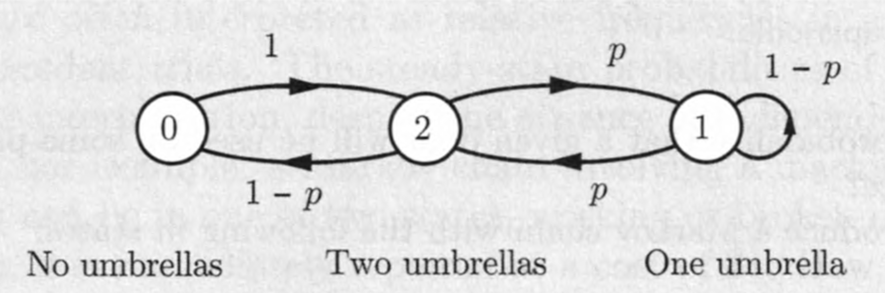
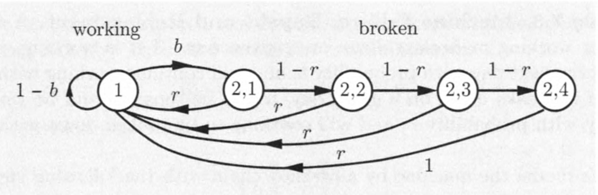
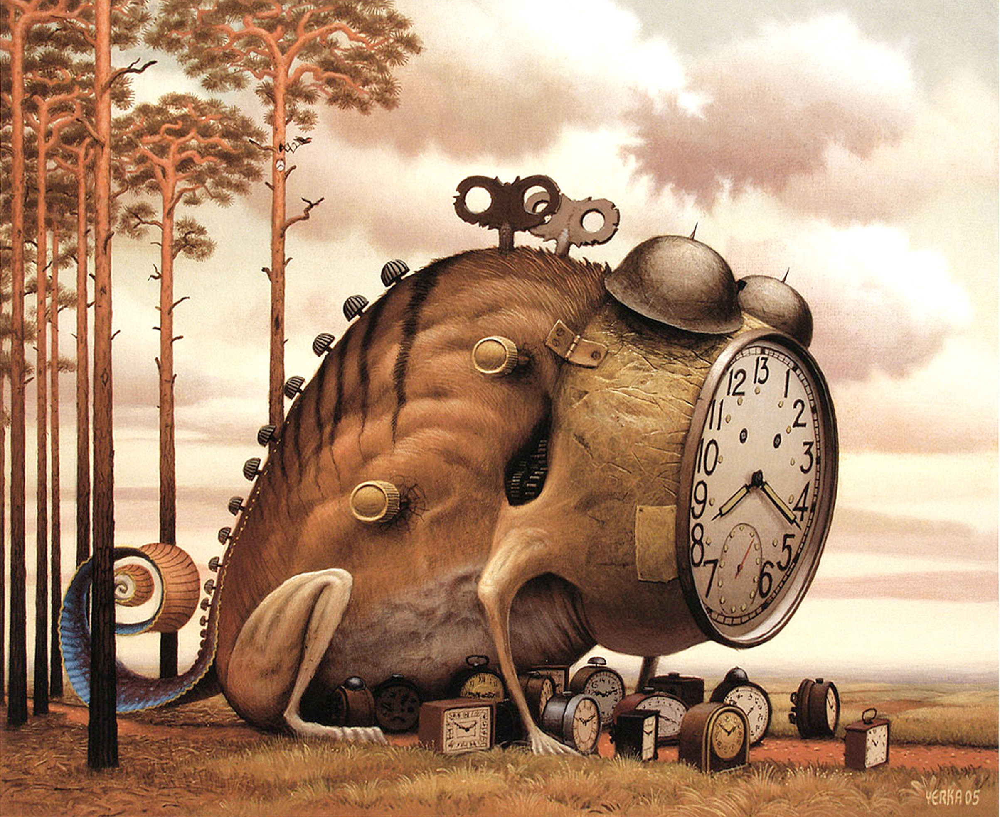

## Revisão

- Nos modelos de cadeia de Markov, estamos frequentemente interessados no comportamento de ocupação de estado a longo prazo.
    + Isto é, nas probabilidades de transição em $n$-passos $p_{ij}^n$ quando $n$ é muito grande.
- Vimos alguns exemplos que $p_{ij}^n$ pode convergir para valores estáveis que são __independentes do estado inicial__.
    + Queremos entender até que ponto esse comportamento é típico.

## Revisão

- Se houver duas ou mais classes de estados recorrentes, é claro que os valores limites de $p_{ij}^n$ devem depender do estado inicial.
    + A possibilidade de visitar $j$ no futuro depende de se $j$ está na mesma classe que o estado inicial $i$.
- Vamos, portanto, restringir a atenção às cadeias envolvendo uma única classe recorrente, além de possivelmente alguns estados transientes.
    + Isso não é tão restritivo quanto parece, já que sabemos que, uma vez que o estado entra em uma determinada classe recorrente, ele permanecerá dentro dessa classe.
- Assim, o comportamento assintótico de uma cadeia com múltiplas classes pode ser entendida em termos do comportamento assintótico de uma cadeia de classe única.
    
## Revisão

- Mesmo para cadeias com uma única classe recorrente, $p_{ij}^n$ pode não convergir.
- Para ver isso, considere uma classe recorrente com dois estados, 1 e 2, de modo que, a partir do estado 1, só podemos ir para 2, e de 2 só podemos ir para 1 ($p_{12} = p_{21} = 1$).
- Então, começando em algum estado, estaremos nesse estado depois de qualquer número par de transições, e no outro estado depois de qualquer número ímpar de transições.

$$
p_{ii}^n = \left\{\begin{array}{ll}
1,& \mbox{se}\ n\ \mbox{é par},\\
0,& \mbox{se}\ n\ \mbox{é ímpar}.
\end{array}\right.
$$

- O que está acontecendo aqui é que a classe recorrente é __periódica__, e para tal classe, pode-se ver que $p_{ij}^n$ oscila genericamente.

## Revisão

- Na aula passada afirmamos que para cada estado $j$, a probabilidade $p_{ij}^n$ de estar no estado $j$ se aproxima de um valor limite que é independente do estado inicial $i$, desde que excluamos as duas situações discutidas acima (múltiplas classes recorrentes e/ou classe periódica).
- Este valor limite, denotado por $\pi_j$, tem a interpretação

$$
\pi_j \approx \Pr(X_n = j)\ \mbox{quando}\ n\ \mbox{é grande}
$$

\noindent e que é chamada de __probabilidade de estado estacionário__.

## Teorema da convergência ao estado estacionário

Considere uma cadeia de Markov com uma única classe recorrente, que é aperiódica. Então, os estados $j$ são associados com probabilidades de estado estacionário $\pi_j$ que têm as seguintes propriedades.

a. $\lim_{n\rightarrow \infty}{p_{ij}^n} = \pi_j$, para todo $i,j$.
b. As $\pi_j$ são a solução única do sistema de equações abaixo:
\begin{eqnarray*}
\pi_j &=& \sum_{k=1}^m{\pi_k p_{kj}}, \ j = 1, \ldots, m.\\
1  &=& \sum_{k=1}^m{\pi_k}.
\end{eqnarray*}
c. Temos
\begin{eqnarray*}
\pi_j &=& 0,\ \mbox{para todo}\ j\ \mbox{transiente},\\
\pi_j &>& 0,\ \mbox{para todo}\ j\ \mbox{recorrente}.
\end{eqnarray*}

## Comentários

- Como $\sum_{j=1}^m{\pi_j}=1$, as $\pi_j$ formam uma distribuição no espaço de estados, chamada a __distribuição estacionária__ da cadeia.
- As equações $\pi_j = \sum_{k=1}^m{\pi_k p_{kj}},\ j = 1,\ldots, m,$ são chamadas as __equações de balanço__.
    + As equações de balanço formam um sistema de equações lineares que, em conjunto com a restrição $\sum_{j=1}^m{\pi_j}=1$, pode ser resolvido para obter $\pi_j$.
        - As equações de balanço sempre tem uma solução não-negativa para qualquer cadeia de Markov.
        - O que é especial a respeito de uma cadeia com uma única classe recorrente, que é aperiódica, é que a solução é única e também é igual ao limite das probabilidades de transição $p_{ij}^n$.

## Exemplo (Alice)

```{r echo=FALSE, fig.align='center', message=FALSE, warning=FALSE, out.width='70%', paged.print=FALSE}
knitr::include_graphics('images/alice_prob.png')
```

1. A cadeia acima atende as condições do teorema?
2. Encontre as equações de balanço da cadeia.
3. Resolva o sistema de equações para obter a distribuição estacionária da cadeia.
4. Qual o limite de $p_{ij}^n$.

## Exemplo (Alice)

As equações de balanço tomam a forma de

$$
\pi_1 = 0.8 \pi_1 + 0.6 \pi_2,\quad \pi_2 = 0.2 \pi_1 + 0.4 \pi_2.
$$

Note que as duas equações são dependentes, e equivalentes a 

$$
\pi_1 = 3 \pi_2.
$$

- Esta é uma propriedade genérica e, de fato, pode ser mostrado que qualquer uma das equações de equilíbrio (balanço) pode sempre ser derivada das equações restantes.

## Exemplo (Alice)

- No entanto, também sabemos que o $\pi_j$ satisfaz a equação de normalização 

$$
\pi_1 + \pi_2 = 1.
$$

- Desta forma, obtemos $3\pi_2 + \pi_2 = 1$, ou

$$
\pi_1 = 0.75,\quad \pi_2 = 0.25.
$$

## Exemplo (o professor e os guarda-chuvas)

- Um professor distraído tem dois guarda-chuvas que usa quando se desloca de casa para o escritório e vice-versa.
- Se chover e houver um guarda-chuva disponível em seu local, ele o pegará.
- Se não estiver chovendo, ele sempre se esquece de pegar um guarda-chuva.
- Suponha que chova com probabilidade $p$ cada vez que ele se deslocar, independente de outras vezes.
- Qual é a probabilidade de estado estacionário de que ele se molhe durante uma viagem?

## Exemplo (o professor e os guarda-chuvas)

```{r echo=FALSE, fig.align='center', message=FALSE, warning=FALSE, out.width='70%', paged.print=FALSE}

```

- A cadeia possui uma única classe recorrente que é aperiódica (assumindo que $0 < p < 1$).
- As equações de balanço são

\begin{eqnarray*}
\pi_0 &=& \\
\pi_1 &=& \\
\pi_2 &=& 
\end{eqnarray*}

## Exemplo (o professor e os guarda-chuvas)

- As probabilidades de estado estacionário são

$$
\pi_0 = \frac{1 - p}{3 - p},\quad \pi_1 = \frac{1}{3 - p},\quad \pi_2 = \frac{1}{3 - p}.
$$

- A probabilidade de estado estacionário de que ele se molhe é $\pi_0$ vezes a probabilidade de chuva $p$.
- __Pergunta:__ o que acontece quando $p$ é grande ou pequeno?

## Exercício (falha e substituição da máquina)

Uma máquina pode estar funcionando ou quebrada em um determinado dia.

- Se estiver funcionando, ele irá quebrar no próximo dia com probabilidade $b$, e continuará trabalhando com probabilidade $1 - b$.
- Se quebrar em um determinado dia, ele será reparada e estará trabalhando no dia seguinte com probabilidade $r$, e continuará quebrada com probabilidade $1- r$.
    + __Exercício 1:__ especifique o espaço de estados.
    + __Exercício 2:__ construa a matriz e o diagrama de probabilidades de transição.
    + __Exercício 3:__ dado um longo perído de tempo, qual a probabilidade de estarmos em um estado qualquer?

## Para casa (falha, reparo e substituição da máquina)

<!-- - A situação considerada aqui evidentemente tem a propriedade Markov: o estado da máquina no dia seguinte depende explicitamente apenas de seu estado nos dias atuais. -->
<!-- - No entanto, é possível usar um modelo de cadeia de Markov, mesmo que haja uma dependência dos estados em alguns dias anteriores ao atual. -->
<!-- - A ideia geral é __introduzir alguns estados adicionais__ que codificam informações relevantes de períodos anteriores, como na variação que consideramos a seguir. -->

<!-- ## Exemplo III. Falha, reparo e substituição da máquina -->

- Suponha que, sempre que a máquina permaneça quebrada por um determinado número de $\ell$ dias, apesar dos esforços de reparo, ela seja substituída por uma nova máquina em funcionamento.
- Para modelar este caso como uma cadeia de Markov, substituímos o estado 2, correspondente a uma máquina quebrada, com vários estados que indicam o número de dias que a máquina está quebrada.
- Esses estados são

$$
\mbox{Estado}\ (2,i): \mbox{a máquina esteve quebrada por } i \mbox{dias}, i = 1,2,\ldots,\ell.
$$

## Para casa (falha, reparo e substituição da máquina)

Considere $\ell = 4$. Uma máquina que permaneceu quebrada por 4 dias é substituída por uma nova máquina em funcionamento.

```{r echo=FALSE, fig.align='center', message=FALSE, warning=FALSE, out.width='90%', paged.print=FALSE}

```

- Se existir, qual a distribuição estacionária desta cadeia? Qual a interpretação podemos fazer?

## $\pi_j$ como uma frequência de visitas

$$
\pi_j = \sum_{k=1}^m{\pi_k p_{kj}}
$$

- A frequência (a longo prazo) de estar em $j$: $\pi_j$
- A frequência de transições $k\rightarrow j$: $\pi_k p_{kj}$
- A frequência de transições para $j$: $\sum_{k=1}^m{\pi_k p_{kj}}$

## $\pi_j$ como uma frequência de visitas

```{r echo=FALSE, fig.align='center', message=FALSE, warning=FALSE, out.width='70%', paged.print=FALSE}
knitr::include_graphics('images/visit_freq_interpret.png')
```

## Próxima aula

- Entrega da Lista de Exercícios 1

```{r echo=FALSE, fig.align='center', message=FALSE, warning=FALSE, out.width='60%', out.height='70%', paged.print=FALSE}

```

## Próxima aula

- Processos de Nascimentos e Mortes

```{r echo=FALSE, fig.align='center', message=FALSE, warning=FALSE, out.width='90%', out.height='70%', paged.print=FALSE}
knitr::include_graphics('images/BirthDeath-Ratio-Final.jpg')
```

## Próxima aula

- Google encontra Markov: o algoritmo PageRank

```{r echo=FALSE, fig.align='center', message=FALSE, warning=FALSE, out.width='90%', out.height='80%', paged.print=FALSE}
knitr::include_graphics('images/google-pagerank.jpg')
```

## Bons estudos!

```{r echo=FALSE, fig.align='center', message=FALSE, warning=FALSE, out.width='90%', out.height='80%', paged.print=FALSE}

```