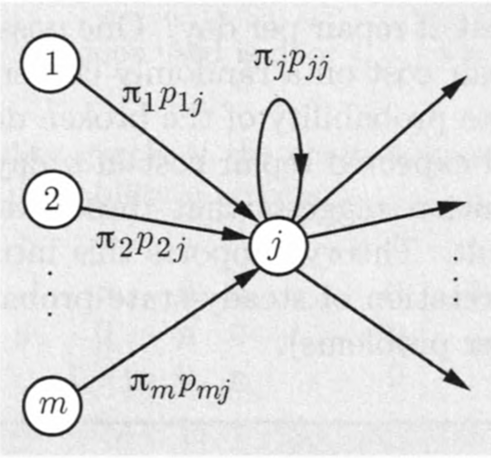
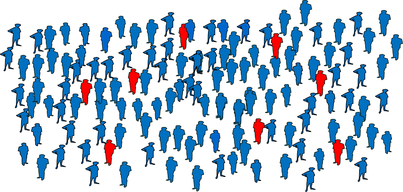
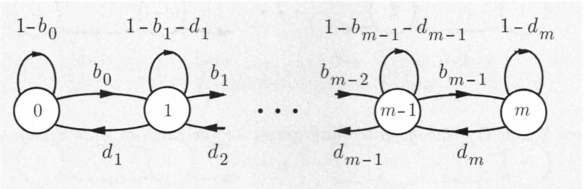
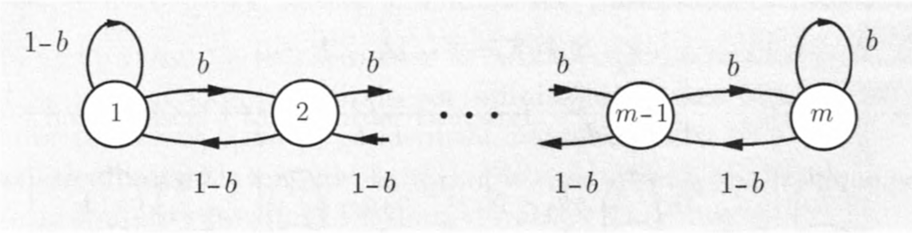
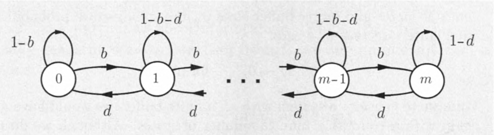
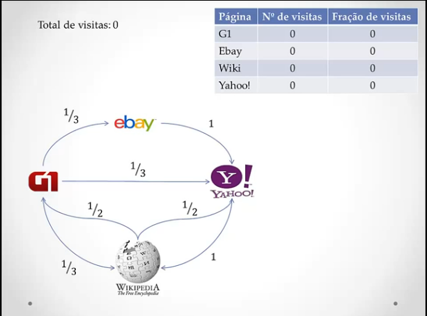
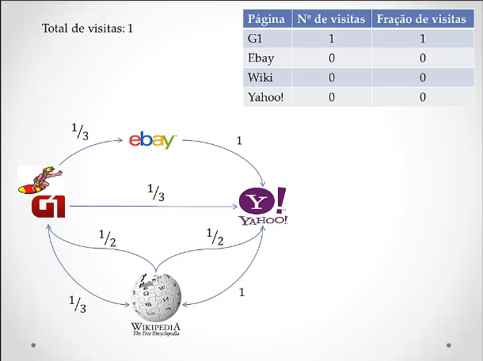
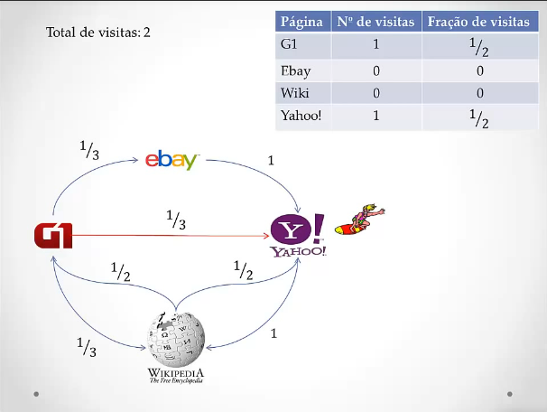
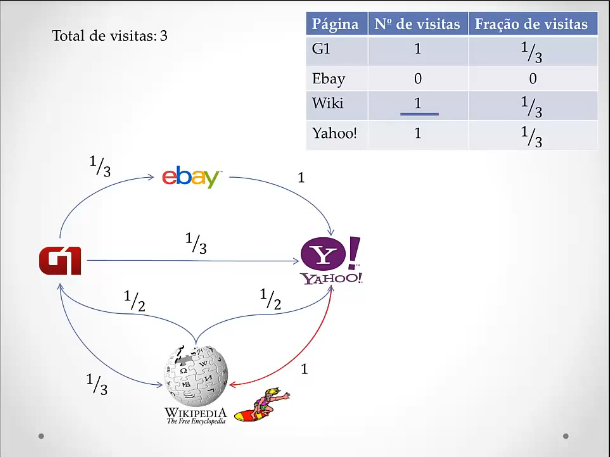
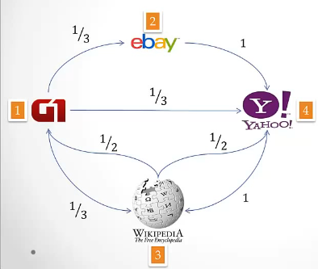

## (Relembrando) Teo. da convergência ao estado estacionário

Considere uma cadeia de Markov com uma única classe recorrente, que é aperiódica. Então, os estados $j$ são associados com probabilidades de estado estacionário $\pi_j$ que têm as seguintes propriedades.

a. $\lim_{n\rightarrow \infty}{p_{ij}^n} = \pi_j$, para todo $i,j$.
b. As $\pi_j$ são a solução única do sistema de equações abaixo:
\begin{eqnarray*}
\pi_j &=& \sum_{k=1}^m{\pi_k p_{kj}}, \ j = 1, \ldots, m.\\
1  &=& \sum_{k=1}^m{\pi_k}.
\end{eqnarray*}
c. Temos
\begin{eqnarray*}
\pi_j &=& 0,\ \mbox{para todo}\ j\ \mbox{transiente},\\
\pi_j &>& 0,\ \mbox{para todo}\ j\ \mbox{recorrente}.
\end{eqnarray*}

## (Relembrando) $\pi_j$ como uma frequência de visitas

$$
\pi_j = \sum_{k=1}^m{\pi_k p_{kj}}
$$

- A frequência (a longo prazo) de estar em $j$: $\pi_j$
- A frequência de transições $k\rightarrow j$: $\pi_k p_{kj}$
- A frequência de transições para $j$: $\sum_{k=1}^m{\pi_k p_{kj}}$

## (Relembrando) $\pi_j$ como uma frequência de visitas

```{r echo=FALSE, fig.align='center', message=FALSE, warning=FALSE, out.width='70%', paged.print=FALSE}

```

## Processos de Nascimento e Morte

```{r echo=FALSE, fig.align='center', message=FALSE, warning=FALSE, out.width='100%', out.height='90%', paged.print=FALSE}

```

## Processos de Nascimento e Morte

- Um processo de __nascimento e morte__ é uma cadeia de Markov no qual os estados são organizados linearmente e as transições só podem ocorrer para um estado vizinho, ou então deixar o estado inalterado.
- Processos de nascimento e morte têm muitas aplicações em
    + __demografia__
    + __teoria de filas__
    + __epidemiologia__
    + __biologia__

## Processos de Nascimento e Morte

- Eles podem ser usados, por exemplo, para estudar a evolução das bactérias

```{r echo=FALSE, fig.align='center', message=FALSE, warning=FALSE, out.width='90%', out.height='80%', paged.print=FALSE}

```

## Processos de Nascimento e Morte

- o número de pessoas com uma doença dentro de uma população

```{r echo=FALSE, fig.align='center', message=FALSE, warning=FALSE, out.width='90%', out.height='80%', paged.print=FALSE}

```

## Processos de Nascimento e Morte

- ou o número de clientes na fila do supermercado.

```{r echo=FALSE, fig.align='center', message=FALSE, warning=FALSE, out.width='90%', out.height='80%', paged.print=FALSE}

```

## Processos de Nascimento e Morte

- Diagrama de transição de um processo de nascimento e morte com espaço de estados $S = \{0, 1, \ldots, m\}$.

```{r echo=FALSE, fig.align='center', message=FALSE, warning=FALSE, out.width='80%', paged.print=FALSE}

```

\begin{eqnarray*}
b_i = \Pr(X_{n + 1} = i + 1 | X_n = i),\ (\mbox{prob. de nascimento ("birth") no estado }i),\\
d_i = \Pr(X_{n + 1} = i - 1 | X_n = i),\ (\mbox{prob. de morte ("death") no estado }i). 
\end{eqnarray*}

## Processos de Nascimento e Morte

__A distribuição estacionária__

- Para um processo de nascimento e morte, as equações de balanço podem ser substancialmente simplificadas.
- Vamos nos concentrar em dois estados vizinhos, digamos $i$ e $i + 1$.
- Em qualquer trajetória da cadeia de Markov, uma transição de $i$ para $i + 1$ tem que ser seguida por uma transição de $i + 1$ para $i$, __antes que outra transição__ de $i$ para $i + 1$ possa ocorrer.
    + Portanto, a __freqüência esperada de transições__ de $i$ para $i + 1$, que é $\pi_ib_i$, __deve ser igual__ à freqüência esperada de transições de $i + 1$ para $i$, que é $\pi_{i + 1}d_{i + 1}$.

## Processos de Nascimento e Morte

__A distribuição estacionária__

- Isso nos leva às equações do equilíbrio local

$$
\pi_ib_i = \pi_{i+1}d_{i+1},\ i = 0, 1, \ldots, m - 1.
$$

- Utilizando as equações de balanço local, obtemos

$$
\pi_i= \pi_0\frac{b_0b_1\ldots b_{i-1}}{d_1d_2\ldots d_i},\ i = 1, \ldots, m.
$$
\noindent que, em conjunto com a equação de normalização $\sum_{j=1}^m{\pi_j} = 1$, nos fornecem as probabilidades $\pi_j$ facilmente.

## Processos de Nascimento e Morte

__Equações de balanço local__ (uma derivação mais formal)

- A equação de balanço para o estado 0 é $\pi_0 = \pi_0(1 - b_0) + \pi_1d_1$ que nos fornece a primeira euqção de balanço local ${\color{purple}{\pi_0b_0 = \pi_1d_1}}$.
- A equação de balanço para o estado 1 é $\pi_1 = {\color{purple}{\pi_0b_0}} + \pi_1(1 - b_1 - d_1) + \pi_2d_2$.
    + Usando a equação de balanço local do estado prévio $\pi_0b_0 = \pi_1d_1$, esta última é reescrita como $\pi_1 = {\color{purple}{\pi_1d_1}} + \pi_1(1 - b_1 - d_1) + \pi_2d_2$, que simplifica como $\color{blue}{\pi_1b_1 = \pi_2d_2}$.
- Podemos continuar de maneira similar para obter as equações de balanço dos demais estados.

## Processos de Nascimento e Morte

__A distribuição estacionária__ (retomando)

- Note que a distribuição estacionária depende de $\pi_0$ e de

$$
\Gamma_i = \left\{\begin{array}{ll}
1,& i = 0,\\
\frac{b_0b_1\ldots b_{i-1}}{d_1d_2\ldots d_i},& i \geq 1.
\end{array}\right.
$$

\noindent de modo que $\color{blue}{\pi_i = \Gamma_i\pi_0}$, e com a equação de normalização 
$$
1 = \sum_{j=0}^m{\pi_j} = \pi_0\sum_{j=0}^m{\Gamma_j} {\color{red}{\Rightarrow}} \pi_0\ = \frac{1}{\sum_{j=0}^m{\Gamma_j}},
$$

\noindent de forma geral temos a distribuição estacionária para o processo de nascimento e morte dada por

$$
\pi_i = \frac{\Gamma_i}{\sum_{j=0}^m{\Gamma_j}},\ i = 0, 1, \ldots, m.
$$

## Passeio aleatório com barreiras refletoras

```{r echo=FALSE, fig.align='center', message=FALSE, warning=FALSE, out.width='80%', paged.print=FALSE}

```

- __Pergunta:__ este processo estocástico é um processo de nascimento e morte?

## Passeio aleatório com barreiras refletoras

- __Sim!__
    + Note que $b_i = b, d_i = 1 - b$ (e portanto $1 - b_i - d_i = 0$), $i = 1, \ldots, m$.
- Dos resultados do processo de nascimento e morte temos que
    + as equações de balanço local são dadas por $\pi_ib = \pi_{i + 1}(1 - b)$;
    + $\Gamma_i = \rho^{i-1},\ i = 1, \ldots, m$, em que $\rho = b/(1 - b)$;
    + a distrbuição estacionária $\pi_i = \displaystyle{\frac{\rho^{i-1}}{\sum_{j=1}^m{\rho^{j-1}}}} = \displaystyle{\frac{\rho^{i-1}}{1 + \rho + \rho^2 + \ldots + \rho^{m-1}}}$.

## Passeio aleatório com barreiras refletoras

- Se $b = 0,5$ (igual probabilidade de ir para esquerda e para direita), então $\rho = 1$, e a distrbiuição estacionária $\pi_i = 1/m,\ i = 1, \ldots, m$ é igual a __distribuição uniforme discreta__.

```{r, echo=FALSE, eval=TRUE, warning=FALSE, message=FALSE, fig.align='center', out.width="70%"}
b <- 0.5
rho <- b/(1 - b)
m = 10
rho_power <- rep(0, m)
for (j in 1:m) {
  rho_power[j] <- rho ^ (j - 1)
}
pi <- rep(0, m)
for (i in 1:m) {
  pi[i] <- rho_power[i]/sum(rho_power)
}
plot(x = 1:m, y = pi,
     type = "h",
     xlab = expression(i),
     ylab = expression(pi[i]),
     axes = F)
points(x = 1:m, y = pi,
       pch = 16,
       col = "purple")
axis(1, at = 1:m)
axis(2, las = 2)
```

## Passeio aleatório com barreiras refletoras

- Se $b > 0,5$ ($b = 0,6$)

```{r, echo=FALSE, eval=TRUE, warning=FALSE, message=FALSE, fig.align='center', out.width="70%"}
b <- 0.6
rho <- b/(1 - b)
m = 10
rho_power <- rep(0, m)
for (j in 1:m) {
  rho_power[j] <- rho ^ (j - 1)
}
pi <- rep(0, m)
for (i in 1:m) {
  pi[i] <- rho_power[i]/sum(rho_power)
}
plot(x = 1:m, y = pi,
     type = "h",
     xlab = expression(i),
     ylab = expression(pi[i]),
     axes = F)
points(x = 1:m, y = pi,
       pch = 16,
       col = "purple")
axis(1, at = 1:m)
axis(2, las = 2)
```

## Passeio aleatório com barreiras refletoras

- Se $b > 0,5$ ($b = 0,8$)

```{r, echo=FALSE, eval=TRUE, warning=FALSE, message=FALSE, fig.align='center', out.width="70%"}
b <- 0.8
rho <- b/(1 - b)
m = 10
rho_power <- rep(0, m)
for (j in 1:m) {
  rho_power[j] <- rho ^ (j - 1)
}
pi <- rep(0, m)
for (i in 1:m) {
  pi[i] <- rho_power[i]/sum(rho_power)
}
plot(x = 1:m, y = pi,
     type = "h",
     xlab = expression(i),
     ylab = expression(pi[i]),
     axes = F)
points(x = 1:m, y = pi,
       pch = 16,
       col = "purple")
axis(1, at = 1:m)
axis(2, las = 2)
```

## (Para casa) Um processo de filas

Os pacotes chegam em um nó de uma rede de comunicação, onde são armazenados em um _buffer_ e depois transmitidos. A capacidade de armazenamento do _buffer_ é $m$: se $m$ pacotes já estiverem presentes, todos os pacotes recém-chegados serão descartados. Nós discretizamos o tempo em períodos muito pequenos, e assumimos que em cada período, no máximo, um evento pode acontecer que pode alterar o número de pacotes armazenados no nó (a chegada de um novo pacote ou a conclusão da transmissão de um pacote existente).

## (Para casa) Um processo de filas

Em particular, assumimos que em cada período, exatamente um dos ocorre o seguinte:

(a) um novo pacote chega; isso acontece com uma dada probabilidade $b > 0$;
(b) um pacote existente completa a transmissão; isso acontece com uma dada probabilidade $d > 0$ se houver pelo menos um pacote no nó, e com probabilidade $0$ caso contrário;
(c) nenhum novo pacote chega e nenhum pacote existente completa a transmissão; isso acontece com probabilidade $1 - b - d$ se houver pelo menos um pacote no nó, e com probabilidade $1 - b$ caso contrário.

## (Para casa) Um processo de filas

```{r echo=FALSE, fig.align='center', message=FALSE, warning=FALSE, out.width='90%', paged.print=FALSE}

```

## (Para casa) Um processo de filas

- Este é um processo de nascimento e morte?
- Encontre as equações de balanço locais.
- Encontre a distribuição estacionária do processo.
- Avalie a distribuição estacionária para diferentes valores de $b$ e $d$.

## Google encontra Markov: o algoritmo PageRank

```{r echo=FALSE, fig.align='center', message=FALSE, warning=FALSE, out.width='100%', out.height='90%', paged.print=FALSE}

```

## PageRank

- A ferramenta de busca do Google se tornou parte importante da vida de muitas pessoas hoje em dia.
- Já parou para pensar em como as buscas são feitas?
- Melhor ainda, como os resultados são classificados?

## PageRank

- Quando realizamos uma busca, são utilizados dois critérios:

```{r echo=FALSE, fig.align='center', message=FALSE, warning=FALSE, out.width='50%', paged.print=FALSE}

```

- A importância de uma página é medida pelo __PageRank__.
- A ordem dos resultados é definida pela importância das páginas.

## PageRank

- Considere, por exemplo, os _backlinks_ a uma página.
- _Backlinks_ são _links_ de outras páginas apontando para a página sendo analisada.

```{r echo=FALSE, fig.align='center', message=FALSE, warning=FALSE, out.width='40%', paged.print=FALSE}

```

- Quanto mais _backlinks_ uma página tem, maior sua importância?
    + Na verdade não.

## PageRank

- A quantidade de backlinks não é tão importante quanto a qualidade destes links.
- Ou seja, é melhor ter um backlink de um site especialista no tema do seu site que vários backlinks de sites menores e não correlatos.

```{r echo=FALSE, fig.align='center', message=FALSE, warning=FALSE, out.width='60%', paged.print=FALSE}

```

- Qualidade na frente de quantidade.

## PageRank

- Então, como é medida a importância de um backlink?
    + A importância é medida através de uma métrica chamada PageRank.
- O PageRank é uma distribuição de probabilidade que representa a propensão de uma pessoa clicando aleatoriamente em links chegar em uma determinada página.
- A teoria do PageRank se baseia na ideia de que um usuário navegando na internet clica aleatoriamente em links.

```{r echo=FALSE, fig.align='center', message=FALSE, warning=FALSE, out.width='40%', paged.print=FALSE}

```

## PageRank

- O chamaremos de __surfista aleatório__.

```{r echo=FALSE, fig.align='center', message=FALSE, warning=FALSE, out.width='40%', paged.print=FALSE}

```

## PageRank

- Vamos supor um universo de quatro páginas.
- E vamos simular uma trajetória do Surfista Aleatório de acordo com as probabilidades de irmos de um site a outro através dos links da rede.

```{r echo=FALSE, fig.align='center', message=FALSE, warning=FALSE, out.width='70%', paged.print=FALSE}

```

## PageRank

```{r echo=FALSE, fig.align='center', message=FALSE, warning=FALSE, out.width='85%', paged.print=FALSE}

```

## PageRank

```{r echo=FALSE, fig.align='center', message=FALSE, warning=FALSE, out.width='85%', paged.print=FALSE}

```

## PageRank

```{r echo=FALSE, fig.align='center', message=FALSE, warning=FALSE, out.width='85%', paged.print=FALSE}

```

## PageRank

```{r echo=FALSE, fig.align='center', message=FALSE, warning=FALSE, out.width='85%', paged.print=FALSE}

```

## PageRank

```{r echo=FALSE, fig.align='center', message=FALSE, warning=FALSE, out.width='85%', paged.print=FALSE}
knitr::include_graphics('images/pr_ex_6.png')
```

## PageRank

- A rede é muito maior do que a que consideramos.
- Se a cada vez que os links foram atualizadas, formos realizar uma simulação para obtermos a frações de visitas de cada site, então

```{r echo=FALSE, fig.align='center', message=FALSE, warning=FALSE, out.width='45%', out.height="45%", paged.print=FALSE}

```

## PageRank

- __Pergunta:__ existe uma outra forma de obtermos estas frações de visitas de cada site (no longo prazo)?

```{r echo=FALSE, fig.align='center', message=FALSE, warning=FALSE, out.width='20%', out.height="20%", paged.print=FALSE}

```

- __Sim!__ Note a rede de quatro sites forma uma cadeia de Markov com matriz de probabilidades de transição

```{r, echo=FALSE, eval=TRUE, warning=FALSE, message=FALSE}
library(mat2tex)

# matriz de probabilidades de transição
# da cadeia de Markov da rede de sites

pt.sites <- matrix(c(0, 1/3, 1/3, 1/3,
                     0, 0, 0, 1,
                     1/2, 0, 0, 1/2,
                     0, 0, 1, 0),
                   nrow = 4,
                   ncol = 4,
                   byrow = TRUE)
```

```{r, echo=FALSE, eval=TRUE, warning=FALSE, message=FALSE, results='asis'}
"$$ P = " %_% xm(pt.sites, 1) %_% "$$"
```

## PageRank

- Desta forma, o __PageRank__ de um site nada mais é do que a probabilidade de estado estacionário $\pi_i$.
- Podemos obter a distribuição de duas formas
    (1) De forma aproximada: para $n$ grande $\pi_j \approx p_{ij}^n$;
    (2) De forma exata/analítica: resolvendo as equações de balanço.

## PageRank

(1) De forma aproximada:

```{r, echo=FALSE, eval=TRUE, warning=FALSE, message=FALSE}
library(expm)

pt.sites.1000 <- pt.sites %^% 1000
```

```{r, echo=FALSE, eval=TRUE, warning=FALSE, message=FALSE, results='asis'}
"$$ P^{1000} = " %_% xm(pt.sites.1000, 2) %_% "$$"
```

## PageRank

(2) De forma exata/analítica:

\begin{eqnarray*}
\pi_1 &=& 0\times\pi_1 + 0\times\pi_2 + 0.5\times\pi_3 + 0\times\pi_4\\
\pi_2 &=& 0.3\times\pi_1 + 0\times\pi_2 + 0\times\pi_3 + 0\times\pi_4\\
\pi_3 &=& 0.3\times\pi_1 + 0\times\pi_2 + 0\times\pi_3 + 1\times\pi_4\\
\pi_4 &=& 0.3\times\pi_1 + 1\times\pi_2 + 0.5\times\pi_3 + 0\times\pi_4\\
\end{eqnarray*}

\noindent sujeito a restrição $\sum_{j = 1}^4{\pi_j} = 1$.

## PageRank

(2) De forma exata/analítica:

- A solução do sistema de equações é dada por

$$
\pi_1 = 0.20; \pi_2 = 0.07; \pi_3 = 0.40; \pi_4 = 0.33.
$$

## Agradecimento especial

Disciplina de __Avaliação de Desempenho do Curso de Bacharelado em Ciência da Computação da UFRJ__

- __Professores:__ Daniel Sadoc e Paulo Aguiar
- __Componentes:__
    + Carlos Victor
    + Diego Martins
    + Magno Ferreira
    + Marcos Filho
    + Raphael Paiva

Veja o vídeo: https://www.youtube.com/watch?v=lziPo9cnCSc

## Próxima aula

- Probabilidades de absorção e tempo esperado para absorção.

## Bons estudos!

```{r echo=FALSE, fig.align='center', message=FALSE, warning=FALSE, out.width='90%', out.height='80%', paged.print=FALSE}

```